# Bilder der Website: jede Stelle mit fester Nummer

> **Erzeugt** von `npm run bilder` am 20.09.2026, 23:45 Uhr, gemessen an `dist/` vom 20.09.2026, 23:42 Uhr (Branch `2026-09-18-bilder-inventar`). 29 Seiten, je Desktop (1440 px) und Smartphone (390 px).
> **Nicht von Hand bearbeiten**, der nächste Lauf überschreibt die Datei. Motiv, Herkunft und offene Punkte stehen in [`motive.json`](motive.json), die Nummern in [`nummern.json`](nummern.json).

## So benutzt du die Liste

- **Jede Bildstelle hat eine feste Nummer** (B1, B2 …). Sie bleibt, wenn das Bild getauscht wird, und wird nie neu vergeben. Es genügt: „B14 und B27 tauschen“.
- **Eine Datei steht oft an mehreren Stellen.** Wer die Datei ersetzt, ändert alle ihre Stellen. Welche das sind, zeigt [Nach Datei](#nach-datei). Soll nur eine Stelle ein anderes Bild bekommen, braucht sie eine eigene Datei.
- **Datum der Anpassung** = letzte Änderung der Datei im Repository (Git). Nach einem Tausch `npm run build` und `npm run bilder`, dann stimmt es wieder.
- **Mit Vorschaubildern** zum Durchsehen: `output/bilder/bilder-uebersicht.html` (entsteht beim selben Lauf, nur lokal).

## Überblick

- **100 Bildstellen** aus **30 Dateien** auf 17 Seiten, dazu 11 Platzhalter ohne Foto.
- **Am häufigsten verwendet:** `kacheln/autolackierung-leipzig-carcare.webp` (11×), `kacheln/fahrzeugaufbereitung-leipzig-carcare.webp` (10×), `kacheln/smart-repair-leipzig-carcare.webp` (8×), `kacheln/versicherung-schadenabwicklung-leipzig-carcare.webp` (7×), `kacheln/felgenreparatur-leipzig-carcare.webp` (7×).
- **Seiten ohne eigene Fotos** (nur die Stellen „auf allen Seiten“): Leistungen (Übersicht) · Kontakt · Wissen (Übersicht) · Impressum · Datenschutz · alle 7 Wissensartikel.

## Nach Seite

### Auf allen Seiten

| Nr. | Ort des Bildes | Dateiname | Datum der Anpassung |
|---|---|---|---|
| **B1** | Ladebildschirm beim ersten Aufruf der Startseite · Desktop | `hero-leipzig-carcare-desktop.webp` | 20.07.2026 |
| **B2** | Ladebildschirm beim ersten Aufruf der Startseite · Smartphone | `hero-leipzig-carcare-mobile.webp` | 20.07.2026 |
| **B3** | Fußzeile › Hintergrundbild | `footer-leipzig-carcare.webp` | 23.07.2026 |
| **B4** | Vorschaubild beim Teilen (WhatsApp, Facebook, LinkedIn: og:image / twitter:image) | `Unsplash-Stockfoto (extern)` | externes Bild |
| **B5** | Strukturierte Daten für Google (LocalBusiness.image), unsichtbar im Seitenquelltext | `Unsplash-Stockfoto (extern)` | externes Bild |
| **B6** | Strukturierte Daten für Google (AutoRepair.image), unsichtbar im Seitenquelltext | `Unsplash-Stockfoto (extern)` | externes Bild |

### Startseite · `/`

> Der große Hintergrund von „Unsere Leistungen rund ums Fahrzeug“, „Unfallschaden? Wir übernehmen Reparatur, Gutachten und …“, „Autoaufbereitung ist mehr als Reinigung. Es ist Werterhalt“, „Fahrzeug aufbereiten lassen? Wir übernehmen Innenraum …“ zeigt am Desktop das Bild der gerade aktiven Karte. Keine eigene Datei, er wechselt mit der Karte.

| Nr. | Ort des Bildes | Dateiname | Datum der Anpassung |
|---|---|---|---|
| **B7** | Titelbild (Hero) · Desktop | `hero-leipzig-carcare-desktop.webp` | 20.07.2026 |
| **B8** | Titelbild (Hero) · Smartphone | `hero-leipzig-carcare-mobile.webp` | 20.07.2026 |
| **B9** | „Unsere Leistungen rund ums Fahrzeug“ › Karte „Fahrzeugaufbereitung“ | `kacheln/fahrzeugaufbereitung-leipzig-carcare.webp` | 16.07.2026 |
| **B10** | „Unsere Leistungen rund ums Fahrzeug“ › Karte „Unfallinstandsetzung“ | `kacheln/versicherung-schadenabwicklung-leipzig-carcare.webp` | 16.07.2026 |
| **B11** | „Unsere Leistungen rund ums Fahrzeug“ › Karte „Neu- und Reparaturlackierung“ | `kacheln/autolackierung-leipzig-carcare.webp` | 16.07.2026 |
| **B12** | „Unsere Leistungen rund ums Fahrzeug“ › Karte „Smart Repair“ | `kacheln/smart-repair-leipzig-carcare.webp` | 16.07.2026 |
| **B13** | „Unsere Leistungen rund ums Fahrzeug“ › Karte „Dellenentfernung“ | `kacheln/dellenentfernung-leipzig-carcare.webp` | 16.07.2026 |
| **B14** | „Unsere Leistungen rund ums Fahrzeug“ › Karte „Hagelschadenreparatur“ | `kacheln/hagelschadenreparatur-leipzig.webp` | 16.07.2026 |
| **B15** | „Unsere Leistungen rund ums Fahrzeug“ › Karte „Felgenreparatur“ | `kacheln/felgenreparatur-leipzig-carcare.webp` | 16.07.2026 |
| **B16** | „Unsere Leistungen rund ums Fahrzeug“ › Karte „Autoglas / Scheibenfolien“ | `kacheln/autoglas-scheibenreparatur-leipzig-carcare.webp` | 16.07.2026 |
| **B17** | „Unsere Leistungen rund ums Fahrzeug“ › Karte „Leasingrückgabe“ | `kacheln/leasingrueckgabe-leipzig-carcare.webp` | 16.07.2026 |
| **B18** | „Unsere Leistungen rund ums Fahrzeug“ › Karte „Fuhrparkservice“ | `kacheln/autohaus-fuhrpark-service-leipzig-carcare.webp` | 16.07.2026 |
| **B19** | „Unfallschaden? Wir übernehmen Reparatur, Gutachten und …“ › Karte „Schaden melden“ | `kacheln/schaden-melden-leipzig-carcare.webp` | 22.07.2026 |
| **B20** | „Unfallschaden? Wir übernehmen Reparatur, Gutachten und …“ › Karte „Schadenaufnahme“ | `kacheln/schadenaufnahme-leipzig-carcare.webp` | 22.07.2026 |
| **B21** | „Unfallschaden? Wir übernehmen Reparatur, Gutachten und …“ › Karte „Gutachten & Kalkulation“ | `kacheln/kalkulation-leipzig-carcare.webp` | 22.07.2026 |
| **B22** | „Unfallschaden? Wir übernehmen Reparatur, Gutachten und …“ › Karte „Versicherungsabwicklung“ | `kacheln/versicherungsabwicklung-leipzig-carcare.webp` | 22.07.2026 |
| **B23** | „Unfallschaden? Wir übernehmen Reparatur, Gutachten und …“ › Karte „Ersatzwagen nach Verfügbarkeit“ | `kacheln/ersatzwagen-leipzig-carcare.webp` | 22.07.2026 |
| **B24** | „Der richtige Ansprechpartner für Ihr Fahrzeug“ › Karte „Privatkunden“ | `kacheln/privatkunden-leipzig-carcare.webp` | 22.07.2026 |
| **B25** | „Der richtige Ansprechpartner für Ihr Fahrzeug“ › Karte „Versicherungen & Agenturen“ | `kacheln/versicherungen-und-agenturen-leipzig-carcare.webp` | 22.07.2026 |
| **B26** | „Der richtige Ansprechpartner für Ihr Fahrzeug“ › Karte „Autohäuser & Fuhrparks“ | `kacheln/autohaeuser-und-fuhrparks-leipzig-carcare.webp` | 22.07.2026 |
| **B27** | „Autoaufbereitung ist mehr als Reinigung. Es ist Werterhalt“ › Karte „Innenaufbereitung“ | `kacheln/innenaufbereitung-leipzig-carcare.webp` | 23.07.2026 |
| **B28** | „Autoaufbereitung ist mehr als Reinigung. Es ist Werterhalt“ › Karte „Außenaufbereitung“ | `kacheln/fahrzeugaufbereitung-leipzig-carcare.webp` | 16.07.2026 |
| **B29** | „Autoaufbereitung ist mehr als Reinigung. Es ist Werterhalt“ › Karte „Leasingrückgabe vorbereiten“ | `kacheln/smart-repair-leipzig-carcare.webp` | 16.07.2026 |
| **B30** | „Autoaufbereitung ist mehr als Reinigung. Es ist Werterhalt“ › Karte „Mehr über Aufbereitung erfahren“ | `kacheln/wissensdatenbank-leipzig-carcare.webp` | 23.07.2026 |
| **B31** | „Fahrzeug aufbereiten lassen? Wir übernehmen Innenraum …“ › Karte „Leistung auswählen“ | `kacheln/fahrzeugaufbereitung-leipzig-carcare.webp` | 16.07.2026 |
| **B32** | „Fahrzeug aufbereiten lassen? Wir übernehmen Innenraum …“ › Karte „Termin anfragen“ | `kacheln/privatkunden-leipzig-carcare.webp` | 22.07.2026 |
| **B33** | „Fahrzeug aufbereiten lassen? Wir übernehmen Innenraum …“ › Karte „Fahrzeug abgeben“ | `kacheln/ersatzwagen-leipzig-carcare.webp` | 22.07.2026 |
| **B34** | „Fahrzeug aufbereiten lassen? Wir übernehmen Innenraum …“ › Karte „Professionelle Aufbereitung“ | `kacheln/autolackierung-leipzig-carcare.webp` | 16.07.2026 |
| **B35** | „Fahrzeug aufbereiten lassen? Wir übernehmen Innenraum …“ › Karte „Gepflegt zurückerhalten“ | `kacheln/leasingrueckgabe-leipzig-carcare.webp` | 16.07.2026 |

### Unfallinstandsetzung · `/unfallinstandsetzung-leipzig`

| Nr. | Ort des Bildes | Dateiname | Datum der Anpassung |
|---|---|---|---|
| **B36** | Titelbild und Seitenhintergrund (bleibt beim Scrollen stehen) | `kacheln/versicherung-schadenabwicklung-leipzig-carcare.webp` | 16.07.2026 |
| **B37** | „Welche Reparatur Ihr Fahrzeug braucht – und was …“ › Karte „Unfallinstandsetzung“ | `kacheln/versicherung-schadenabwicklung-leipzig-carcare.webp` | 16.07.2026 |
| **B38** | „Welche Reparatur Ihr Fahrzeug braucht – und was …“ › Karte „Neu- und Reparaturlackierung“ | `kacheln/autolackierung-leipzig-carcare.webp` | 16.07.2026 |
| **B39** | „Welche Reparatur Ihr Fahrzeug braucht – und was …“ › Karte „Smart Repair“ | `kacheln/smart-repair-leipzig-carcare.webp` | 16.07.2026 |
| **B40** | „Welche Reparatur Ihr Fahrzeug braucht – und was …“ › Karte „Dellenentfernung“ | `kacheln/dellenentfernung-leipzig-carcare.webp` | 16.07.2026 |
| **B41** | „Welche Reparatur Ihr Fahrzeug braucht – und was …“ › Karte „Hagelschadenreparatur“ | `kacheln/hagelschadenreparatur-leipzig.webp` | 16.07.2026 |
| **B42** | „Welche Reparatur Ihr Fahrzeug braucht – und was …“ › Karte „Felgenreparatur“ | `kacheln/felgenreparatur-leipzig-carcare.webp` | 16.07.2026 |
| **B43** | „Welche Reparatur Ihr Fahrzeug braucht – und was …“ › Karte „Autoglas & Scheibenfolien“ | `kacheln/autoglas-scheibenreparatur-leipzig-carcare.webp` | 16.07.2026 |

### Fahrzeugaufbereitung · `/fahrzeugaufbereitung-leipzig`

| Nr. | Ort des Bildes | Dateiname | Datum der Anpassung |
|---|---|---|---|
| **B44** | Titelbild und Seitenhintergrund (bleibt beim Scrollen stehen) | `kacheln/fahrzeugaufbereitung-leipzig-carcare.webp` | 16.07.2026 |
| **B45** | „Innen, außen und Lack – die drei Bereiche im Überblick“ › Karte „Innenaufbereitung“ | `kacheln/innenaufbereitung-leipzig-carcare.webp` | 23.07.2026 |
| **B46** | „Innen, außen und Lack – die drei Bereiche im Überblick“ › Karte „Außenaufbereitung“ | `kacheln/fahrzeugaufbereitung-leipzig-carcare.webp` | 16.07.2026 |
| **B47** | „Innen, außen und Lack – die drei Bereiche im Überblick“ › Karte „Lackaufbereitung“ | `kacheln/autolackierung-leipzig-carcare.webp` | 16.07.2026 |
| **B48** | „Ergebnisse, die man sieht“ › Platzhalter „Innenaufbereitung“ (Foto fehlt) | — | — |
| **B49** | „Ergebnisse, die man sieht“ › Platzhalter „Außenreinigung“ (Foto fehlt) | — | — |
| **B50** | „Ergebnisse, die man sieht“ › Platzhalter „Lackpolitur“ (Foto fehlt) | — | — |
| **B51** | „Ergebnisse, die man sieht“ › Platzhalter „Cockpit-Detail“ (Foto fehlt) | — | — |
| **B52** | „Ergebnisse, die man sieht“ › Platzhalter „Versiegelung“ (Foto fehlt) | — | — |
| **B53** | „Ergebnisse, die man sieht“ › Platzhalter „Felgenreinigung“ (Foto fehlt) | — | — |
| **B54** | „Ergebnisse, die man sieht“ › Platzhalter „Lederpflege“ (Foto fehlt) | — | — |
| **B55** | „Ergebnisse, die man sieht“ › Platzhalter „Motorraumpflege“ (Foto fehlt) | — | — |
| **B56** | „Ergebnisse, die man sieht“ › Platzhalter „Keramikschutz“ (Foto fehlt) | — | — |
| **B57** | „Ergebnisse, die man sieht“ › Platzhalter „Politur-Finish“ (Foto fehlt) · nur Desktop | — | — |
| **B58** | „Ergebnisse, die man sieht“ › Platzhalter „Endkontrolle“ (Foto fehlt) · nur Desktop | — | — |

### Leasingrückgabe · `/leasingrueckgabe-leipzig`

| Nr. | Ort des Bildes | Dateiname | Datum der Anpassung |
|---|---|---|---|
| **B59** | Titelbild und Seitenhintergrund (bleibt beim Scrollen stehen) | `kacheln/leasingrueckgabe-leipzig-carcare.webp` | 16.07.2026 |
| **B60** | „Von der Parkplatzdelle bis zur Innenraumaufbereitung“ › Karte „Dellen ohne Lackieren“ | `kacheln/dellenentfernung-leipzig-carcare.webp` | 16.07.2026 |
| **B61** | „Von der Parkplatzdelle bis zur Innenraumaufbereitung“ › Karte „Spot-Repair bei Lackschäden“ | `kacheln/smart-repair-leipzig-carcare.webp` | 16.07.2026 |
| **B62** | „Von der Parkplatzdelle bis zur Innenraumaufbereitung“ › Karte „Felgen mit Bordsteinschäden“ | `kacheln/felgenreparatur-leipzig-carcare.webp` | 16.07.2026 |
| **B63** | „Von der Parkplatzdelle bis zur Innenraumaufbereitung“ › Karte „Steinschlag und Scheibenschäden“ | `kacheln/autoglas-scheibenreparatur-leipzig-carcare.webp` | 16.07.2026 |
| **B64** | „Von der Parkplatzdelle bis zur Innenraumaufbereitung“ › Karte „Größere Lack- und Karosserieschäden“ | `kacheln/autolackierung-leipzig-carcare.webp` | 16.07.2026 |
| **B65** | „Von der Parkplatzdelle bis zur Innenraumaufbereitung“ › Karte „Aufbereitung innen und außen“ | `kacheln/fahrzeugaufbereitung-leipzig-carcare.webp` | 16.07.2026 |

### Außenaufbereitung · `/aussenaufbereitung-leipzig`

| Nr. | Ort des Bildes | Dateiname | Datum der Anpassung |
|---|---|---|---|
| **B66** | Titelbild und Seitenhintergrund (bleibt beim Scrollen stehen) | `kacheln/fahrzeugaufbereitung-leipzig-carcare.webp` | 16.07.2026 |

### Innenaufbereitung · `/innenaufbereitung-leipzig`

| Nr. | Ort des Bildes | Dateiname | Datum der Anpassung |
|---|---|---|---|
| **B67** | Titelbild und Seitenhintergrund (bleibt beim Scrollen stehen) | `kacheln/innenaufbereitung-leipzig-carcare.webp` | 23.07.2026 |

### Smart Repair · `/smart-repair-leipzig`

| Nr. | Ort des Bildes | Dateiname | Datum der Anpassung |
|---|---|---|---|
| **B68** | Titelbild und Seitenhintergrund (bleibt beim Scrollen stehen) | `kacheln/smart-repair-leipzig-carcare.webp` | 16.07.2026 |

### Neu- und Reparaturlackierung · `/autolackierung-leipzig`

| Nr. | Ort des Bildes | Dateiname | Datum der Anpassung |
|---|---|---|---|
| **B69** | Titelbild und Seitenhintergrund (bleibt beim Scrollen stehen) | `kacheln/autolackierung-leipzig-carcare.webp` | 16.07.2026 |

### Dellenentfernung · `/dellenentfernung-leipzig`

| Nr. | Ort des Bildes | Dateiname | Datum der Anpassung |
|---|---|---|---|
| **B70** | Titelbild und Seitenhintergrund (bleibt beim Scrollen stehen) | `kacheln/dellenentfernung-leipzig-carcare.webp` | 16.07.2026 |

### Hagelschadenreparatur · `/hagelschadenreparatur-leipzig`

| Nr. | Ort des Bildes | Dateiname | Datum der Anpassung |
|---|---|---|---|
| **B71** | Titelbild und Seitenhintergrund (bleibt beim Scrollen stehen) | `kacheln/hagelschadenreparatur-leipzig.webp` | 16.07.2026 |

### Felgenreparatur · `/felgenreparatur-leipzig`

| Nr. | Ort des Bildes | Dateiname | Datum der Anpassung |
|---|---|---|---|
| **B72** | Titelbild und Seitenhintergrund (bleibt beim Scrollen stehen) | `kacheln/felgenreparatur-leipzig-carcare.webp` | 16.07.2026 |

### Fuhrparkservice · `/fuhrparkservice-leipzig`

| Nr. | Ort des Bildes | Dateiname | Datum der Anpassung |
|---|---|---|---|
| **B73** | Titelbild und Seitenhintergrund (bleibt beim Scrollen stehen) | `kacheln/autohaus-fuhrpark-service-leipzig-carcare.webp` | 16.07.2026 |

### Autoglas & Scheibenfolien · `/autoglas-leipzig`

| Nr. | Ort des Bildes | Dateiname | Datum der Anpassung |
|---|---|---|---|
| **B74** | Titelbild und Seitenhintergrund (bleibt beim Scrollen stehen) | `kacheln/autoglas-scheibenreparatur-leipzig-carcare.webp` | 16.07.2026 |

### Privatkunden · `/privatkunden`

| Nr. | Ort des Bildes | Dateiname | Datum der Anpassung |
|---|---|---|---|
| **B75** | Titelbild und Seitenhintergrund (bleibt beim Scrollen stehen) | `kacheln/privatkunden-leipzig-carcare.webp` | 22.07.2026 |
| **B76** | „Was wir für Ihr Fahrzeug tun können“ › Karte „Fahrzeugaufbereitung“ | `kacheln/fahrzeugaufbereitung-leipzig-carcare.webp` | 16.07.2026 |
| **B77** | „Was wir für Ihr Fahrzeug tun können“ › Karte „Unfallschaden & Reparatur“ | `kacheln/versicherung-schadenabwicklung-leipzig-carcare.webp` | 16.07.2026 |
| **B78** | „Was wir für Ihr Fahrzeug tun können“ › Karte „Smart Repair“ | `kacheln/smart-repair-leipzig-carcare.webp` | 16.07.2026 |
| **B79** | „Was wir für Ihr Fahrzeug tun können“ › Karte „Dellen ohne Lackieren“ | `kacheln/dellenentfernung-leipzig-carcare.webp` | 16.07.2026 |
| **B80** | „Was wir für Ihr Fahrzeug tun können“ › Karte „Neu- und Reparaturlackierung“ | `kacheln/autolackierung-leipzig-carcare.webp` | 16.07.2026 |
| **B81** | „Was wir für Ihr Fahrzeug tun können“ › Karte „Hagelschaden“ | `kacheln/hagelschadenreparatur-leipzig.webp` | 16.07.2026 |
| **B82** | „Was wir für Ihr Fahrzeug tun können“ › Karte „Felgenreparatur“ | `kacheln/felgenreparatur-leipzig-carcare.webp` | 16.07.2026 |
| **B83** | „Was wir für Ihr Fahrzeug tun können“ › Karte „Autoglas & Scheibenfolien“ | `kacheln/autoglas-scheibenreparatur-leipzig-carcare.webp` | 16.07.2026 |

### Geschäftskunden · `/geschaeftskunden`

| Nr. | Ort des Bildes | Dateiname | Datum der Anpassung |
|---|---|---|---|
| **B84** | Titelbild und Seitenhintergrund (bleibt beim Scrollen stehen) | `kacheln/autohaeuser-und-fuhrparks-leipzig-carcare.webp` | 22.07.2026 |
| **B85** | „Das komplette Spektrum – auch für gewerbliche Auftraggeber“ › Karte „Unfallinstandsetzung“ | `kacheln/versicherung-schadenabwicklung-leipzig-carcare.webp` | 16.07.2026 |
| **B86** | „Das komplette Spektrum – auch für gewerbliche Auftraggeber“ › Karte „Neu- und Reparaturlackierung“ | `kacheln/autolackierung-leipzig-carcare.webp` | 16.07.2026 |
| **B87** | „Das komplette Spektrum – auch für gewerbliche Auftraggeber“ › Karte „Smart Repair“ | `kacheln/smart-repair-leipzig-carcare.webp` | 16.07.2026 |
| **B88** | „Das komplette Spektrum – auch für gewerbliche Auftraggeber“ › Karte „Dellenentfernung“ | `kacheln/dellenentfernung-leipzig-carcare.webp` | 16.07.2026 |
| **B89** | „Das komplette Spektrum – auch für gewerbliche Auftraggeber“ › Karte „Hagelschadenreparatur“ | `kacheln/hagelschadenreparatur-leipzig.webp` | 16.07.2026 |
| **B90** | „Das komplette Spektrum – auch für gewerbliche Auftraggeber“ › Karte „Felgenreparatur“ | `kacheln/felgenreparatur-leipzig-carcare.webp` | 16.07.2026 |
| **B91** | „Das komplette Spektrum – auch für gewerbliche Auftraggeber“ › Karte „Autoglas & Scheibenfolien“ | `kacheln/autoglas-scheibenreparatur-leipzig-carcare.webp` | 16.07.2026 |
| **B92** | „Das komplette Spektrum – auch für gewerbliche Auftraggeber“ › Karte „Fahrzeugaufbereitung“ | `kacheln/fahrzeugaufbereitung-leipzig-carcare.webp` | 16.07.2026 |

### Über uns · `/ueber-uns`

| Nr. | Ort des Bildes | Dateiname | Datum der Anpassung |
|---|---|---|---|
| **B93** | Titelbild und Seitenhintergrund (bleibt beim Scrollen stehen) › Standbild des Videos | `carcare-ueber-uns-hero-standbild.webp` | 07.09.2026 |
| **B94** | Titelbild und Seitenhintergrund (bleibt beim Scrollen stehen) › Video | `carcare-ueber-uns-hero.mp4` | 07.09.2026 |
| **B95** | „Alles im eigenen Haus – vom Kratzer bis zum Totalschaden“ › Karte „Karosserie & Unfallinstandsetzung“ | `kacheln/versicherung-schadenabwicklung-leipzig-carcare.webp` | 16.07.2026 |
| **B96** | „Alles im eigenen Haus – vom Kratzer bis zum Totalschaden“ › Karte „Neu- und Reparaturlackierung“ | `kacheln/autolackierung-leipzig-carcare.webp` | 16.07.2026 |
| **B97** | „Alles im eigenen Haus – vom Kratzer bis zum Totalschaden“ › Karte „Smart Repair & Dellenentfernung“ | `kacheln/smart-repair-leipzig-carcare.webp` | 16.07.2026 |
| **B98** | „Alles im eigenen Haus – vom Kratzer bis zum Totalschaden“ › Karte „Hagelschadenreparatur“ | `kacheln/hagelschadenreparatur-leipzig.webp` | 16.07.2026 |
| **B99** | „Alles im eigenen Haus – vom Kratzer bis zum Totalschaden“ › Karte „Felgen & Autoglas“ | `kacheln/felgenreparatur-leipzig-carcare.webp` | 16.07.2026 |
| **B100** | „Alles im eigenen Haus – vom Kratzer bis zum Totalschaden“ › Karte „Fahrzeugaufbereitung“ | `kacheln/fahrzeugaufbereitung-leipzig-carcare.webp` | 16.07.2026 |
| **B101** | „Ein Rundgang durch die Hallen“ › Standbild des Videos | `carcare-betriebsrundgang-standbild.webp` | 07.09.2026 |
| **B102** | „Ein Rundgang durch die Hallen“ › Video | `carcare-betriebsrundgang.mp4` | 07.09.2026 |

### Karriere · `/karriere`

> Der große Hintergrund von „Vier Gewerke unter einem Dach“ zeigt am Desktop das Bild der gerade aktiven Karte. Keine eigene Datei, er wechselt mit der Karte.

| Nr. | Ort des Bildes | Dateiname | Datum der Anpassung |
|---|---|---|---|
| **B103** | „Vier Gewerke unter einem Dach“ › Karte „Kfz-Aufbereiter“ | `kacheln/innenaufbereitung-leipzig-carcare.webp` | 23.07.2026 |
| **B104** | „Vier Gewerke unter einem Dach“ › Karte „Fahrzeuglackierer“ | `kacheln/autolackierung-leipzig-carcare.webp` | 16.07.2026 |
| **B105** | „Vier Gewerke unter einem Dach“ › Karte „Karosserie- und Fahrzeugbaumechaniker“ | `kacheln/versicherung-schadenabwicklung-leipzig-carcare.webp` | 16.07.2026 |
| **B106** | „Vier Gewerke unter einem Dach“ › Karte „Serviceberater“ | `kacheln/autohaus-fuhrpark-service-leipzig-carcare.webp` | 16.07.2026 |
| **B107** | „Vier Gewerke unter einem Dach“ › „Ausbildung im Betrieb“ › Karte „Fahrzeuglackierer/in“ | `kacheln/autolackierung-leipzig-carcare.webp` | 16.07.2026 |
| **B108** | „Vier Gewerke unter einem Dach“ › „Ausbildung im Betrieb“ › Karte „Karosserie- und Fahrzeugbaumechaniker/in“ | `kacheln/schadenaufnahme-leipzig-carcare.webp` | 22.07.2026 |
| **B109** | „Vier Gewerke unter einem Dach“ › „Ausbildung im Betrieb“ › Karte „Industriekaufmann/-frau“ | `kacheln/kalkulation-leipzig-carcare.webp` | 22.07.2026 |
| **B110** | „So sieht der Betrieb aus, in dem Sie arbeiten würden“ › Standbild des Videos | `carcare-arbeitsplatz-standbild.webp` | 07.09.2026 |
| **B111** | „So sieht der Betrieb aus, in dem Sie arbeiten würden“ › Video | `carcare-arbeitsplatz.mp4` | 07.09.2026 |

## Nach Datei

Wer eine Datei ersetzt, ändert alle ihre Stellen. Herkunft nur mit Beleg; **ob KI beteiligt war, ist für kein Foto dokumentiert**, das klärt der Abgleich mit André.

| Vorschau | Datei | Motiv | Stellen | Datum der Anpassung | Herkunft laut Repository | Offene Punkte |
|---|---|---|---|---|---|---|
| 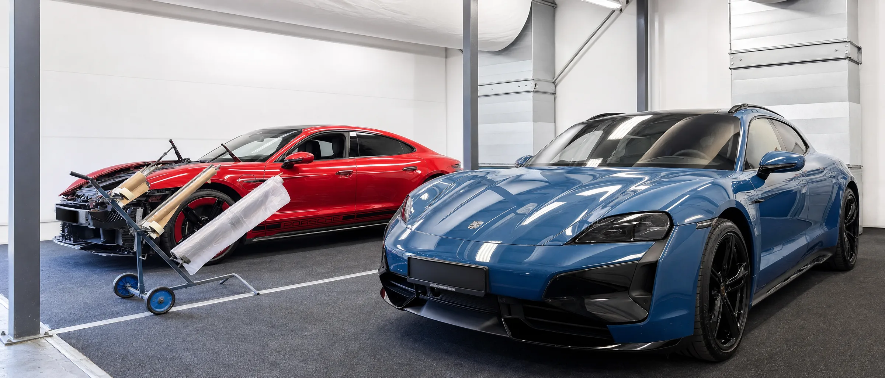 | `hero-leipzig-carcare-desktop.webp` 2400 × 1029 · 284 KB | Zwei Porsche Taycan in heller Halle: vorn blau, dahinter rot mit demontierter Front (Querformat) | **2×** B1, B7 | 20.07.2026 | nicht dokumentiert (eingebaut 20.07.2026, Commit 24f6dd3) | 4.1 Felgen des blauen Porsche retuschieren |
| 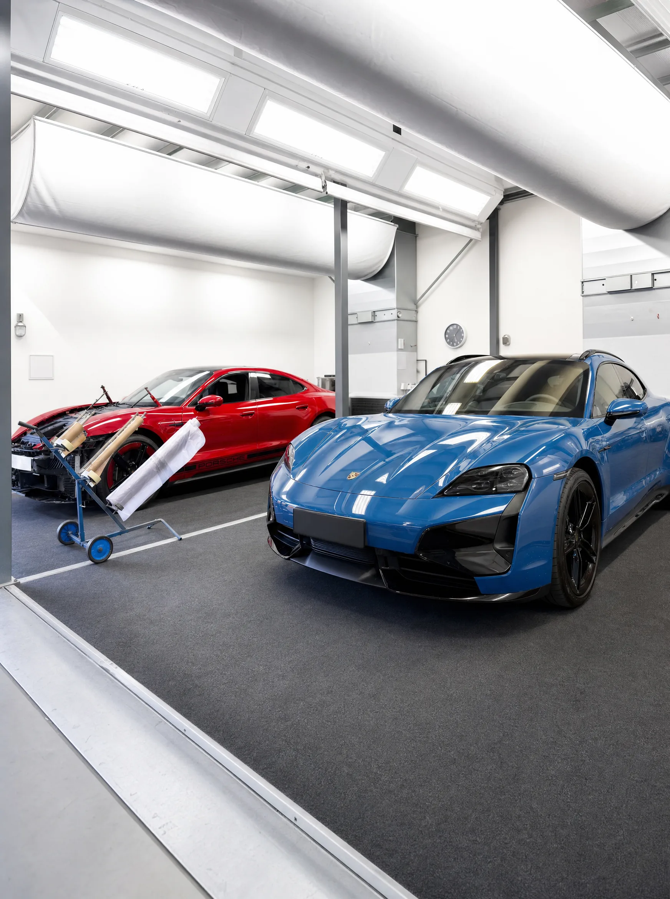 | `hero-leipzig-carcare-mobile.webp` 1744 × 2336 · 373 KB | Dasselbe Motiv hochkant (Zuschnitt fürs Smartphone) | **2×** B2, B8 | 20.07.2026 | nicht dokumentiert (eingebaut 20.07.2026, Commit 24f6dd3) | 4.1 Felgen des blauen Porsche retuschieren |
|  | `footer-leipzig-carcare.webp` 2400 × 900 · 36 KB | Die zwei Porsche Taycan aus dem Startbild, stark abgedunkelt mit Blauverlauf | **1×** B3 | 23.07.2026 | Kundenmotiv (Commit 12b9f4b, 23.07.2026) |  |
|  | `Unsplash-Stockfoto (extern)` | Externes Stockfoto von Unsplash, kein Bild des Betriebs | **3×** B4, B5, B6 | externes Bild | Stockfoto (Unsplash) | R7 echtes Vorschaubild statt Stockfoto (og:image und strukturierte Daten) |
| 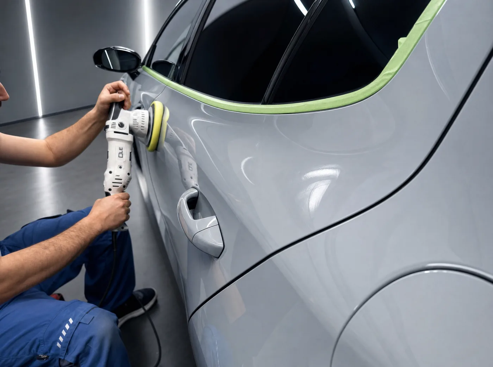 | `kacheln/fahrzeugaufbereitung-leipzig-carcare.webp` 1400 × 1045 · 58 KB | Poliermaschine an der abgeklebten Tür eines silbergrauen Fahrzeugs (Nahaufnahme) | **10×** B9, B28, B31, B44, B46, B65, B66, B76, B92, B100 | 16.07.2026 | nicht dokumentiert (16.07.2026) | R2 eigenes Motiv für Außenaufbereitung (die Datei steht dort nur leihweise) |
| 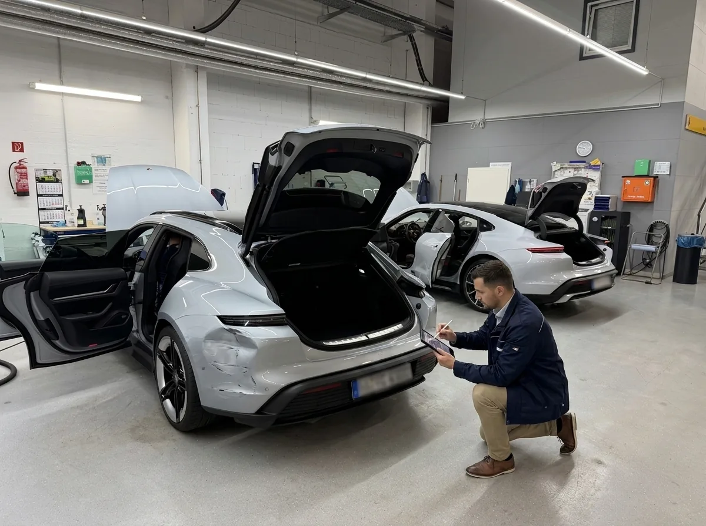 | `kacheln/versicherung-schadenabwicklung-leipzig-carcare.webp` 1200 × 896 · 112 KB | Mitarbeiter mit Tablet kniet hinter einem silbernen Porsche Taycan mit Heckschaden | **7×** B10, B36, B37, B77, B85, B95, B105 | 16.07.2026 | nicht dokumentiert (16.07.2026) | 2.16 Titelbild der Unfallseite wirkt wie Schadensaufnahme, nicht wie Instandsetzung |
| 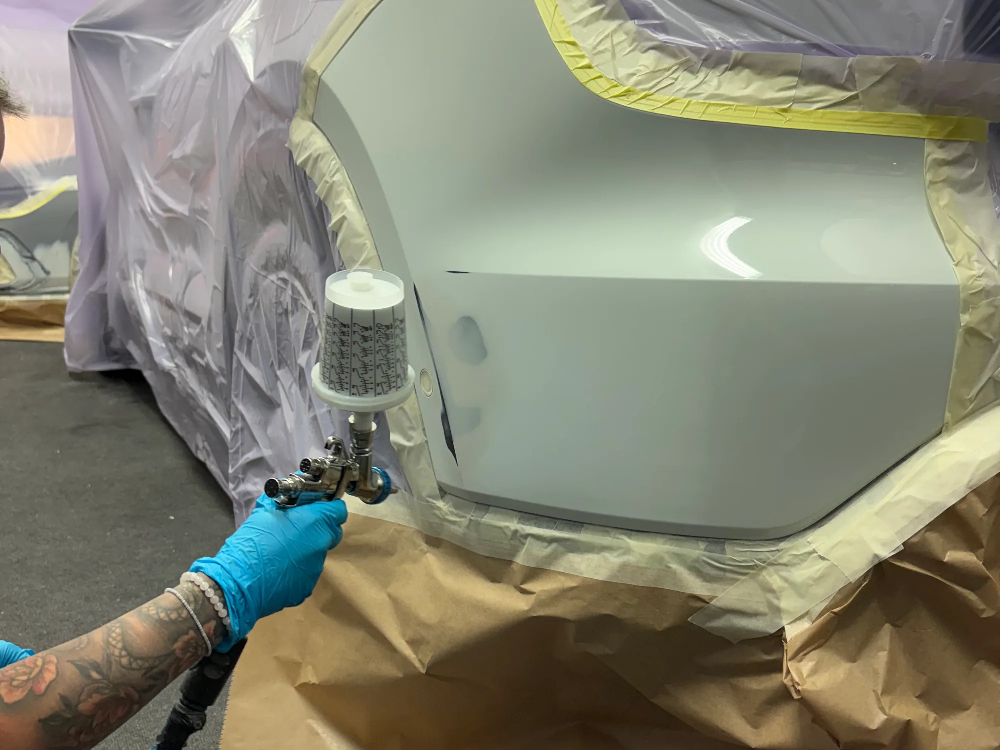 | `kacheln/autolackierung-leipzig-carcare.webp` 1400 × 1045 · 160 KB | Lackierer mit Atemschutz lackiert in der Kabine ein mit Folie abgedecktes Fahrzeug | **11×** B11, B34, B38, B47, B64, B69, B80, B86, B96, B104, B107 | 16.07.2026 | nicht dokumentiert (16.07.2026) | 3.26 Foto Neu-/Reparaturlackierung (Stoßstange beim Schleifen oder Lackierkabine) |
| 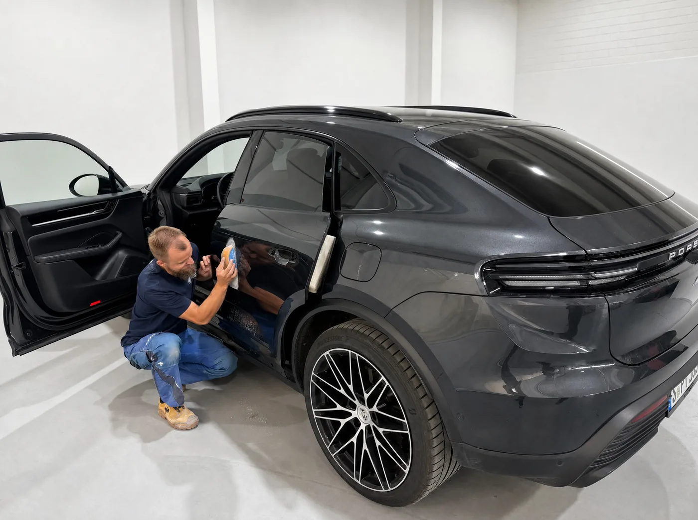 | `kacheln/smart-repair-leipzig-carcare.webp` 1400 × 1045 · 100 KB | Mitarbeiter bearbeitet die Tür eines schwarzen Porsche Macan | **8×** B12, B29, B39, B61, B68, B78, B87, B97 | 16.07.2026 | nicht dokumentiert (16.07.2026) | 3.10 zeigt Aufbereitung, nicht Smart Repair (Motiv über 3.25) · R2 steht auch leihweise für „Leasingrückgabe vorbereiten“ · Kennzeichen am rechten Bildrand teilweise lesbar |
| 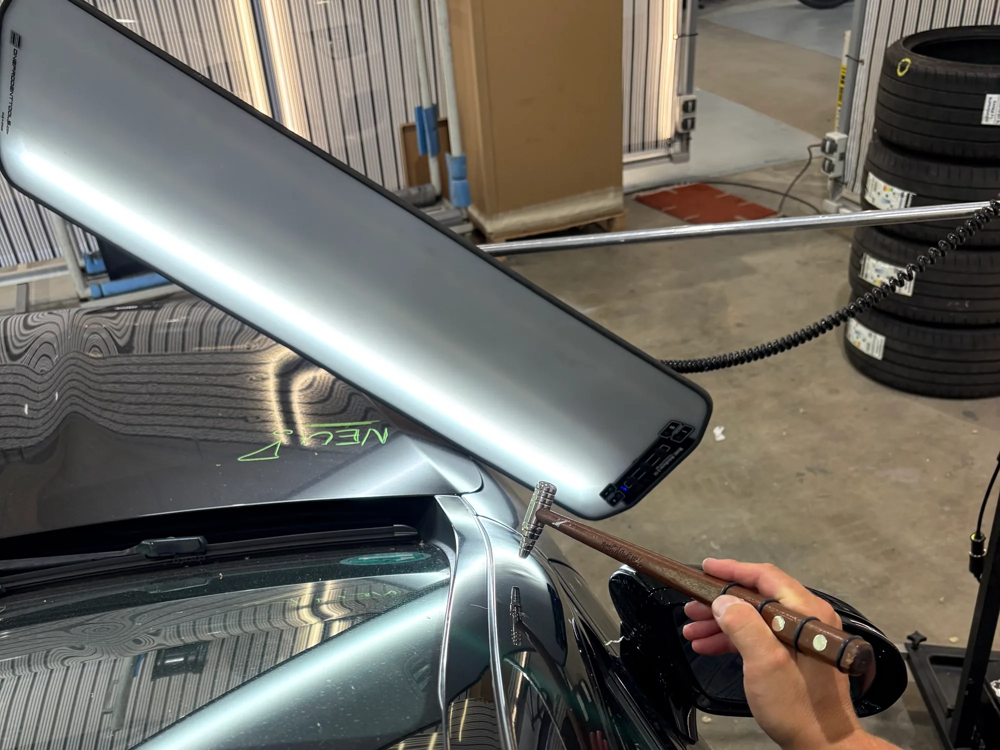 | `kacheln/dellenentfernung-leipzig-carcare.webp` 1200 × 896 · 118 KB | Mitarbeiter mit Dellenlampe an der Tür eines weißen Audi RS 6 Avant | **6×** B13, B40, B60, B70, B79, B88 | 16.07.2026 | nicht dokumentiert (16.07.2026) | 3.11 sauberes Bild hinterlegen, Motiv über 3.24 (Delle, während sie entfernt wird) |
| 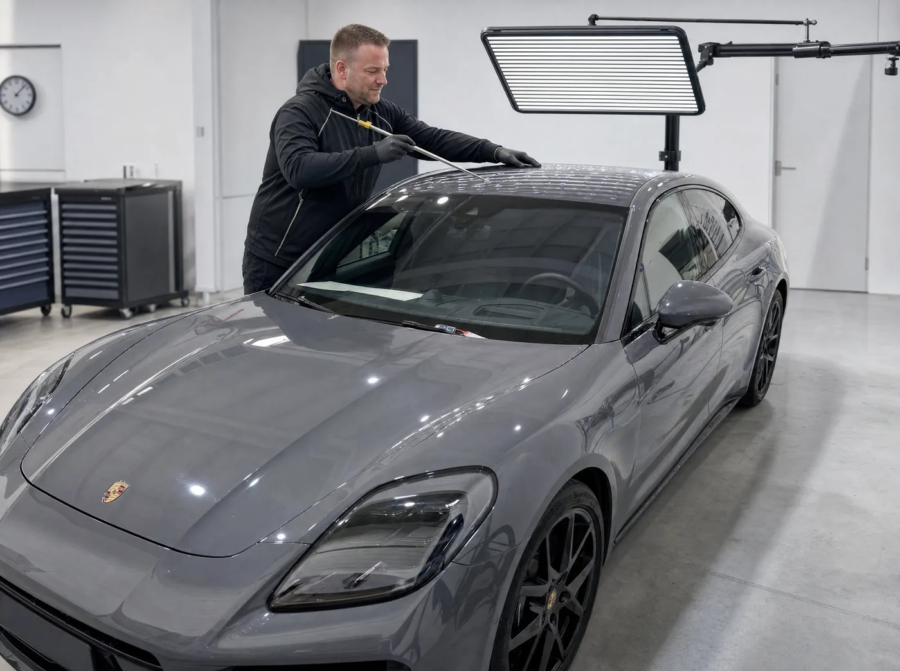 | `kacheln/hagelschadenreparatur-leipzig.webp` 1400 × 1045 · 104 KB | Mitarbeiter drückt am Dach eines grauen Porsche Panamera Dellen aus, Leuchtschirm darüber | **6×** B14, B41, B71, B81, B89, B98 | 16.07.2026 | nicht dokumentiert (16.07.2026) | 3.27 Foto Hagelschaden (Archiv oder anstehendes Fahrzeug) |
| 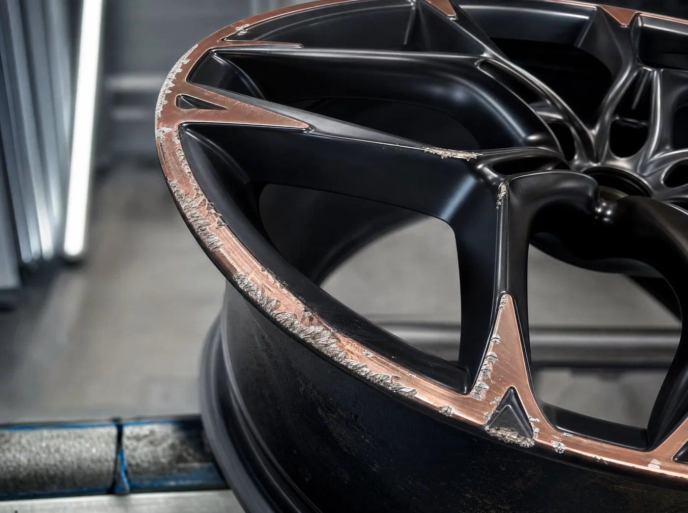 | `kacheln/felgenreparatur-leipzig-carcare.webp` 1400 × 1045 · 96 KB | Beschädigte Felge mit Bordsteinschaden in Nahaufnahme | **7×** B15, B42, B62, B72, B82, B90, B99 | 16.07.2026 | nicht dokumentiert (16.07.2026) | 3.28 Felge in Reparatur / beim Lackieren (vorhanden sind nur beschädigte Felgen) |
| 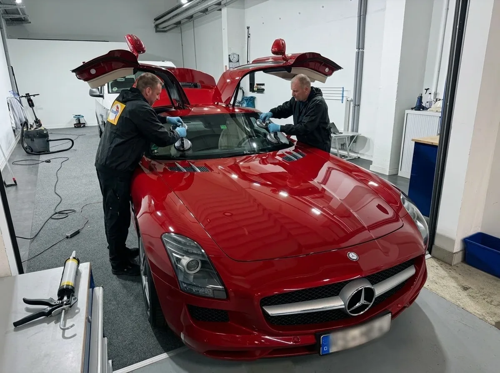 | `kacheln/autoglas-scheibenreparatur-leipzig-carcare.webp` 1200 × 896 · 113 KB | Zwei Mitarbeiter setzen an einem roten Mercedes SLS (Flügeltüren) die Frontscheibe ein | **6×** B16, B43, B63, B74, B83, B91 | 16.07.2026 | nicht dokumentiert (16.07.2026) |  |
| 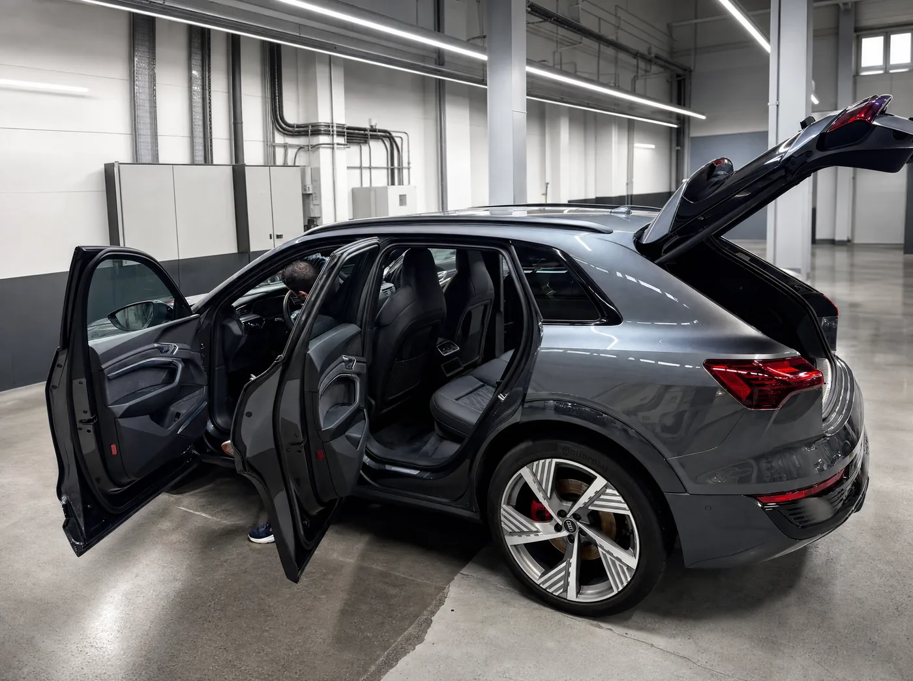 | `kacheln/leasingrueckgabe-leipzig-carcare.webp` 1400 × 1045 · 155 KB | Grauer Audi Q8 e-tron mit allen Türen und Heckklappe offen in der Halle | **3×** B17, B35, B59 | 16.07.2026 | nicht dokumentiert (16.07.2026) |  |
| 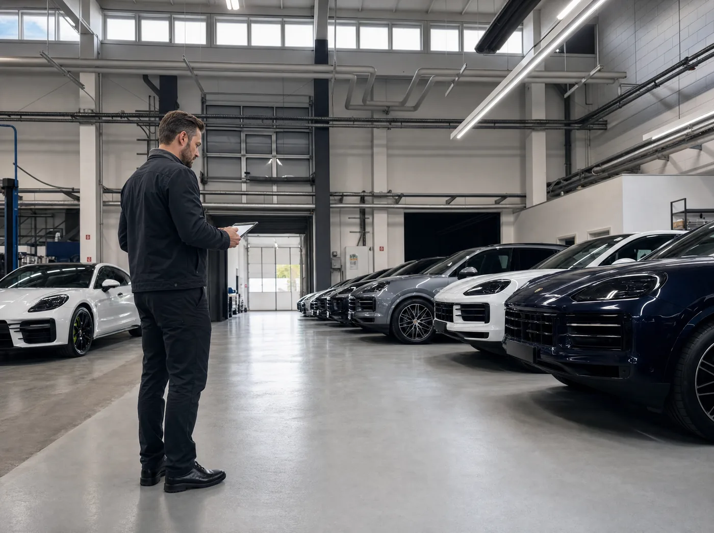 | `kacheln/autohaus-fuhrpark-service-leipzig-carcare.webp` 1400 × 1045 · 123 KB | Mann mit Tablet vor einer Reihe Porsche (Cayenne, Panamera) in großer Halle | **3×** B18, B73, B106 | 16.07.2026 | nicht dokumentiert (16.07.2026) |  |
| 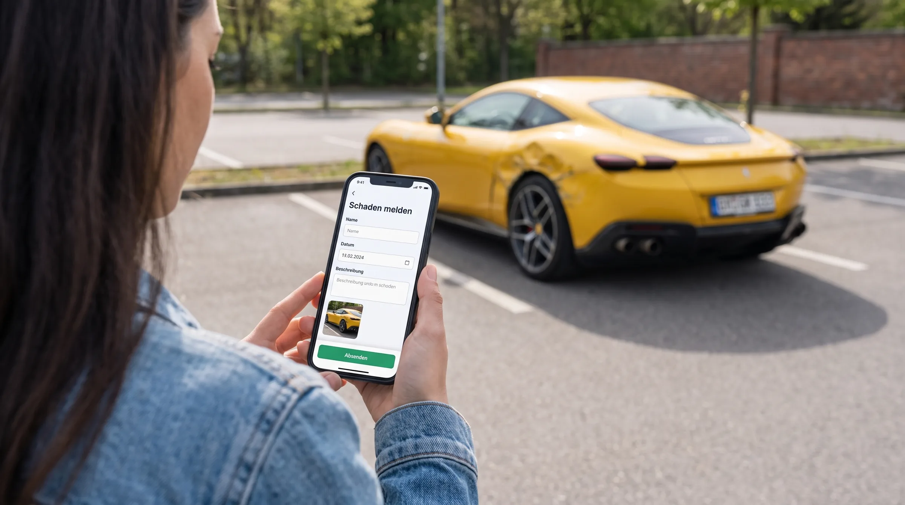 | `kacheln/schaden-melden-leipzig-carcare.webp` 2400 × 1340 · 126 KB | Frau meldet per Smartphone einen Schaden, dahinter gelber Ferrari mit Seitenschaden | **1×** B19 | 22.07.2026 | laut Commit 0d25f7b „echtes Kundenfoto“ (22.07.2026) |  |
| 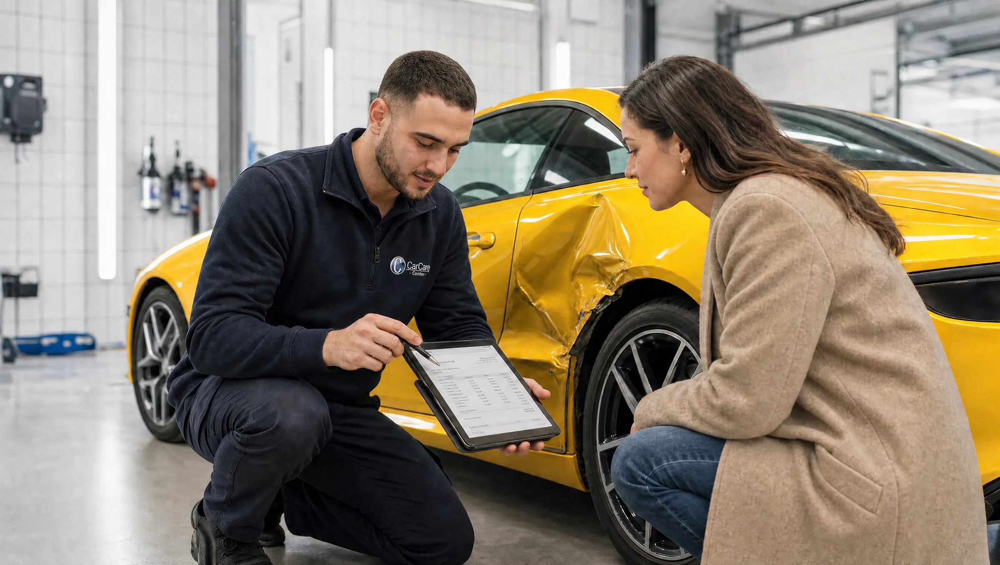 | `kacheln/schadenaufnahme-leipzig-carcare.webp` 2400 × 1357 · 200 KB | Mitarbeiter und Kundin knien am gelben Ferrari mit eingedrückter Tür, Tablet | **2×** B20, B108 | 22.07.2026 | nicht dokumentiert (22.07.2026) | 3.8 ruhigeres Hintergrundmotiv für die Sektion „Schadenaufnahme“ (Startseite, Unfall & Schaden), zusammen mit 2.18 |
|  | `kacheln/kalkulation-leipzig-carcare.webp` 2400 × 1357 · 141 KB | Kundin unterschreibt am Tresen, Berater mit Tablet, gelber Ferrari im Hintergrund | **2×** B21, B109 | 22.07.2026 | nicht dokumentiert (22.07.2026) |  |
| 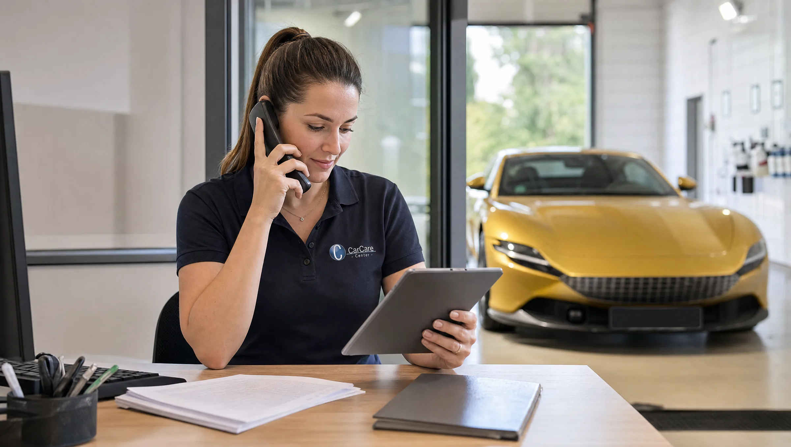 | `kacheln/versicherungsabwicklung-leipzig-carcare.webp` 2400 × 1357 · 120 KB | Mitarbeiterin telefoniert am Schreibtisch mit Tablet, gelber Ferrari im Hintergrund | **1×** B22 | 22.07.2026 | nicht dokumentiert (22.07.2026) |  |
| 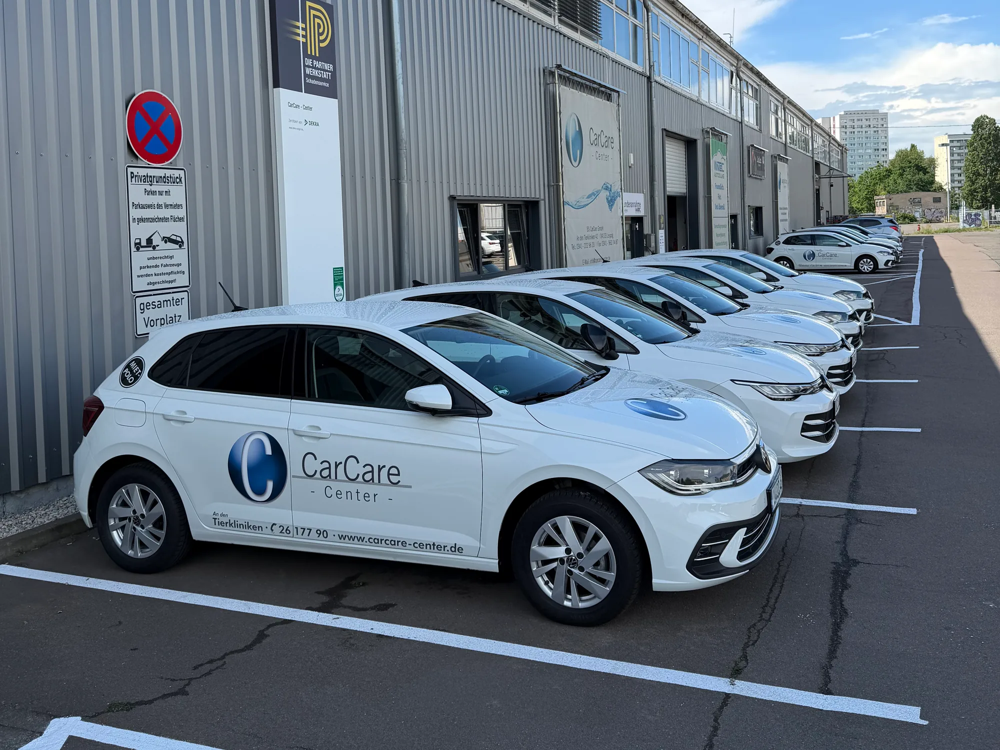 | `kacheln/ersatzwagen-leipzig-carcare.webp` 2400 × 1357 · 160 KB | Mitarbeiter übergibt einer Kundin den Schlüssel, silberner Kleinwagen vor der Halle | **2×** B23, B33 | 22.07.2026 | nicht dokumentiert (22.07.2026) | 2.21 / 3.4 eigener Mietwagen statt Symbolbild |
| 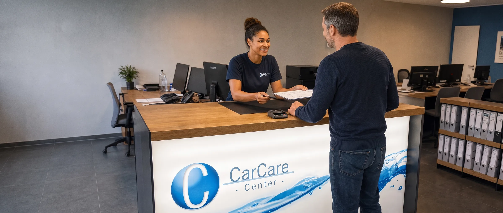 | `kacheln/privatkunden-leipzig-carcare.webp` 2400 × 1018 · 192 KB | Empfangstresen mit CarCare-Center-Logo, Mitarbeiterin berät einen Kunden | **3×** B24, B32, B75 | 22.07.2026 | laut Commit acfcd0c „echte Fotos“ (22.07.2026) |  |
| 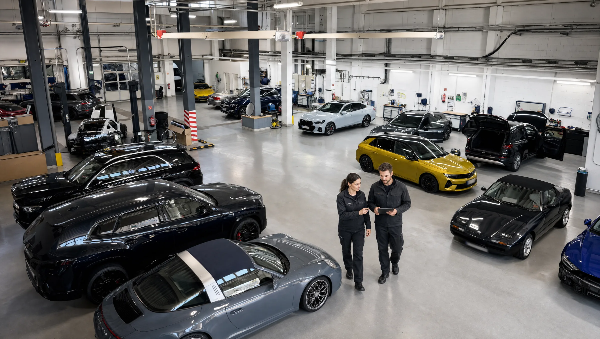 | `kacheln/versicherungen-und-agenturen-leipzig-carcare.webp` 2400 × 1357 · 361 KB | Große Werkhalle mit vielen Fahrzeugen, zwei Mitarbeitende mit Tablet in der Mitte | **1×** B25 | 22.07.2026 | laut Commit acfcd0c „echte Fotos“ (22.07.2026) |  |
| 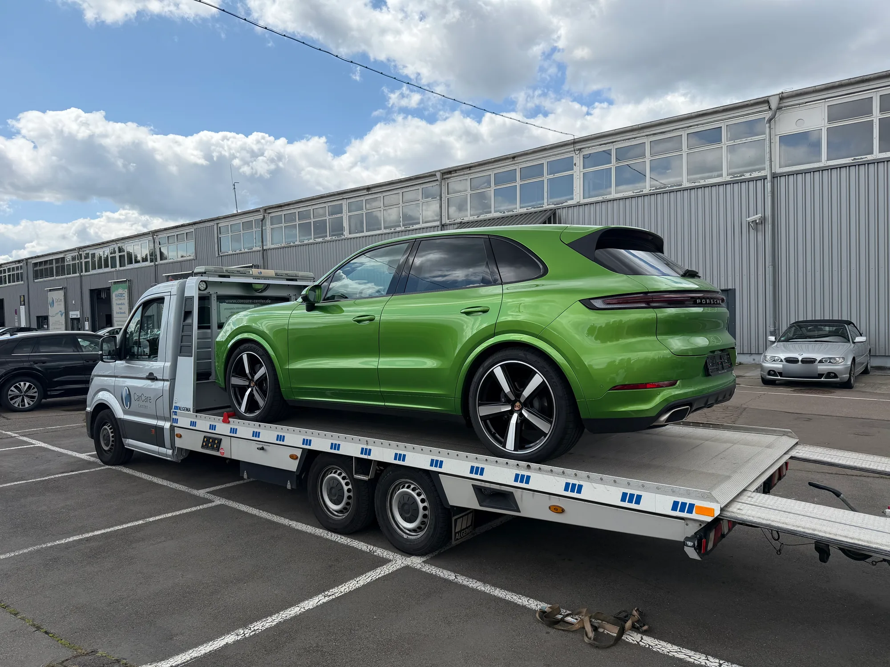 | `kacheln/autohaeuser-und-fuhrparks-leipzig-carcare.webp` 2400 × 1357 · 341 KB | Grüner Bentley auf einem Abschleppwagen vor einem Autohaus, zwei Männer beim Handschlag | **2×** B26, B84 | 22.07.2026 | laut Commit acfcd0c „echte Fotos“ (22.07.2026) | 2.20 Foto Fuhrpark-/Autohausservice (Hänger), laut Kategorienliste für die Geschäftskundenseite |
| 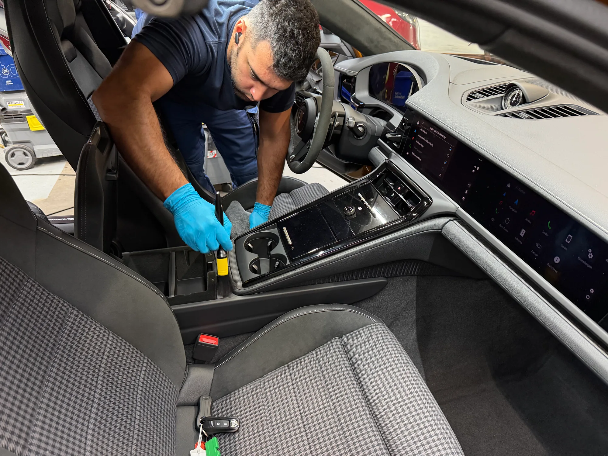 | `kacheln/innenaufbereitung-leipzig-carcare.webp` 2400 × 1340 · 159 KB | Mitarbeiter reinigt mit Pinsel den Innenraum eines gelben Ferrari (Cognac-Leder) | **4×** B27, B45, B67, B103 | 23.07.2026 | Kundenmotiv (Commit de2069b, 23.07.2026) | 2.15 / 3.29 „KI-Bild ersetzen – kein Transporter, eher exklusives Fahrzeug“: Das heutige Motiv zeigt einen Ferrari. Ob der Punkt damit erledigt ist, mit André klären |
| 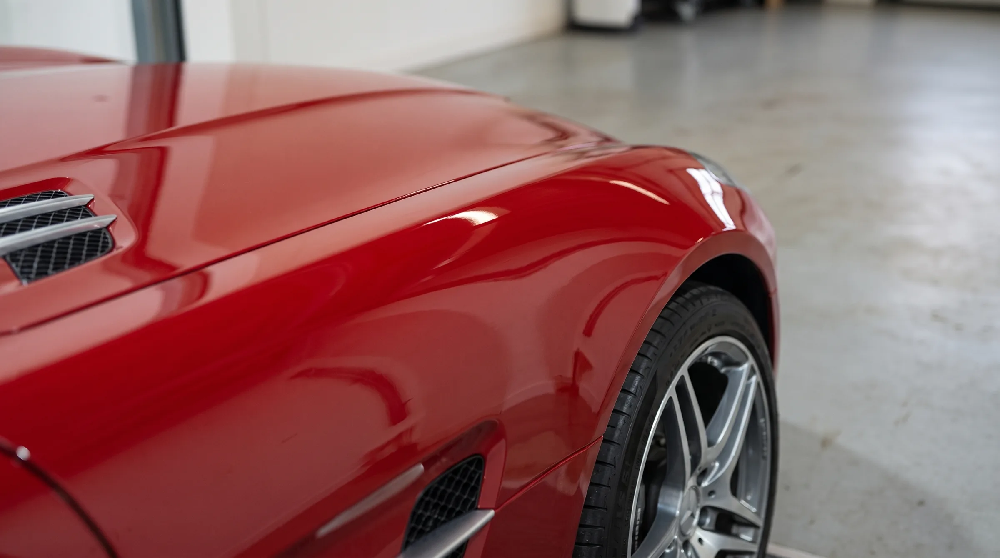 | `kacheln/wissensdatenbank-leipzig-carcare.webp` 2400 × 1340 · 85 KB | Roter Kotflügel eines Mercedes SLS in Nahaufnahme | **1×** B30 | 23.07.2026 | Kundenmotiv (Commit de2069b, 23.07.2026) |  |
| 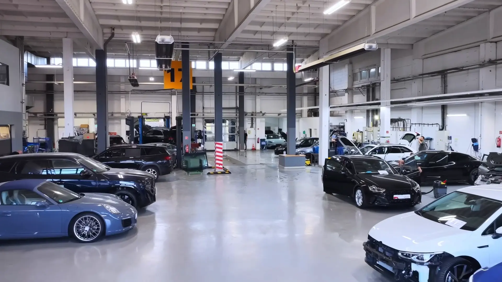 | `carcare-ueber-uns-hero-standbild.webp` 1920 × 1080 · 138 KB | Weite Werkhalle mit vielen Fahrzeugen (Standbild bei 31,1 s) | **1×** B93 | 07.09.2026 | Standbild aus dem Betriebsvideo des Kunden (Lieferung 07.09.2026) |  |
|  | `carcare-ueber-uns-hero.mp4` 2173 KB | Video: Schwenk durch die Werkstatt (Ausschnitt 9,0–21,2 s) | **1×** B94 | 07.09.2026 | Betriebsvideo des Kunden (Lieferung 07.09.2026) |  |
| 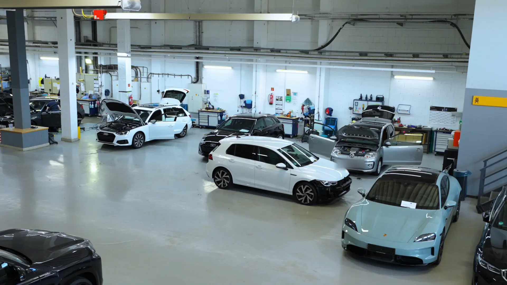 | `carcare-betriebsrundgang-standbild.webp` 1920 × 1080 · 114 KB | Werkhalle von oben: weißer VW Golf, mintfarbener Porsche Taycan, Audi mit offener Haube | **1×** B101 | 07.09.2026 | Standbild aus dem Betriebsvideo des Kunden (Lieferung 07.09.2026) |  |
|  | `carcare-betriebsrundgang.mp4` 3457 KB | Video: Rundgang vom Waschplatz bis zur Lackierkabine (Ausschnitt 21,5–52,2 s) | **1×** B102 | 07.09.2026 | Betriebsvideo des Kunden (Lieferung 07.09.2026) | 4.14 vollständiges Drohnenvideo, Schwenk durch die Karosserieabteilung fehlt · R16 zeigt Mitarbeitende (Einwilligung nach § 22 KUG?) |
| 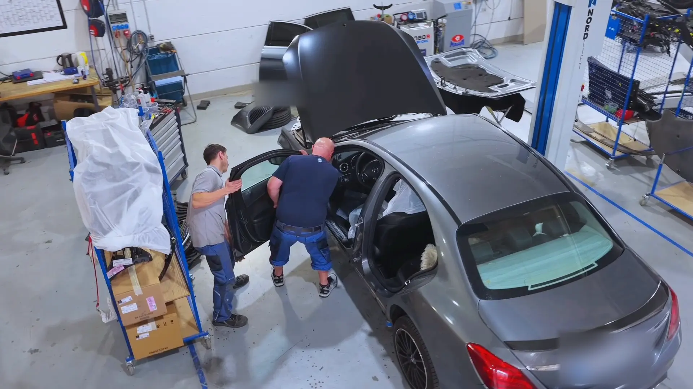 | `carcare-arbeitsplatz-standbild.webp` 1920 × 1080 · 125 KB | Zwei Mitarbeiter an einem grauen Mercedes mit offener Tür (Standbild bei 71,1 s) | **1×** B110 | 07.09.2026 | Standbild aus dem Betriebsvideo des Kunden (Lieferung 07.09.2026) | R16 Kennzeichen eines Kundenfahrzeugs lesbar; zeigt Mitarbeitende (Einwilligung nach § 22 KUG?) |
|  | `carcare-arbeitsplatz.mp4` 3430 KB | Video: von der Lackierkabine bis zum Reifenraum (Ausschnitt 46,3–75,9 s) | **1×** B111 | 07.09.2026 | Betriebsvideo des Kunden (Lieferung 07.09.2026) | R16 Kennzeichen lesbar (etwa Sekunde 22–26); zeigt Mitarbeitende (Einwilligung nach § 22 KUG?) |

## Platzhalter: hier fehlt ein Foto

- **Fahrzeugaufbereitung**, B48, B49, B50, B51, B52, B53, B54, B55, B56, B57, B58: 3.23 Fotopaket Aufbereitung (während der Arbeit) füllt diese Galerie, erledigt damit auch 2.2 und 3.6

## Grafiken und Logos (keine Fotos)

| Datei | Wo | Datum der Anpassung |
|---|---|---|
| `carcare-center-apple-touch-icon.png` 180 × 180 · 8 KB | Favicon (Browser-Tab) (alle Seiten) | nicht committet, Datei geändert am 18.09.2026 |
| `carcare-center-favicon-192.png` 192 × 192 · 16 KB | Favicon (Browser-Tab) (alle Seiten) | nicht committet, Datei geändert am 18.09.2026 |
| `carcare-center-favicon-48.png` 48 × 48 · 3 KB | Favicon (Browser-Tab) (alle Seiten) | nicht committet, Datei geändert am 18.09.2026 |
| `carcare-center-logo.webp` 842 × 596 · 73 KB | Logo-Plakette in Karten (Startseite, Karriere) | 03.06.2026 |
| `carcare-center-mark-animated.mp4` 1623 KB | Kopfzeile (alle Seiten); Logo-Plakette in Karten (Startseite); Fußzeile (alle Seiten) | 17.06.2026 |
| `carcare-center-mark.webp` 264 × 264 · 9 KB | Ladebildschirm beim ersten Aufruf der Startseite | 24.07.2026 |
| `carcare-center-wordmark-dark.webp` 840 × 273 · 26 KB | Ladebildschirm beim ersten Aufruf der Startseite | 24.07.2026 |
| `carcare-center-wordmark-weiss.png` 2118 × 687 · 31 KB | Fußzeile (alle Seiten) | 23.07.2026 |
| `carcare-center-wordmark.png` 3711 × 1205 · 84 KB | Kopfzeile (alle Seiten) | 17.06.2026 |
| `eu-emblem.svg` 3 KB | Fußzeile (alle Seiten) | 24.07.2026 |
| `partner/bvat.webp` 800 × 212 · 27 KB | „Von der Kalkulation bis zur …“ (Hagelschadenreparatur); „Woran sich die Arbeitsqualität festmachen lässt“ (Über uns) | 17.09.2026 |
| `partner/riparo.webp` 208 × 50 · 1 KB | „Der richtige Ansprechpartner für Ihr Fahrzeug“ › Karte „Versicherungen & Agenturen“ (Startseite); „Für diese Unternehmen arbeiten wir bereits“ › Karte „Versicherer & Schadensteuerer“ (Geschäftskunden) | 17.09.2026 |

## Gegenprobe

- **Routen besucht:** 29 von 29 (Quelle `scripts/routes.mjs`), jede mit gerenderter h1.
- **Dateien unter `public/assets/`** (ohne Schriften): 42. Davon im Rundgang gesehen: 41, nur im Code: 1, unbenutzt: 0.
- **Im Code, beim Rundgang nicht gesehen:** nichts Neues.
- **Bekannt und begründet** (`motive.json` → `bekannt`), deshalb nicht angezeigt:
  - `carcare-hero-workshop.webp` in `components/ExpandingCardAccordion.tsx`, `components/TargetGroupCards.tsx`, `pages/UeberUnsPage.tsx`: Ersatzbild: DEFAULT_CARD_BG in ExpandingCardAccordion und TargetGroupCards, Rückfall in UeberUnsPage. Greift nur, wenn einer Karte das Motiv fehlt, und ist deshalb derzeit nirgends sichtbar.
  - `Unsplash-Stockfoto` in `components/Hero.tsx`: Steht nur im toten components/Hero.tsx, das laut Vorgabe ohne Import unangetastet bleibt (offene-punkte-konsolidiert.md, Paket G).
- **Entfallene Nummern:** keine

## Was diese Liste nicht sieht

- Bilder, die erst nach einem Klick erscheinen (Dialoge), und Motive nur für Tablet-Breiten. Beide fängt die Gegenprobe oben ab, sofern der Pfad im Code steht.
- Sektionshintergründe, die das Bild der aktiven Karte spiegeln: keine eigene Stelle, Hinweis steht unter der jeweiligen Seite.
- Ob ein Foto KI-generiert oder -bearbeitet ist. Das lässt sich einem Bild nicht ansehen und wird nicht geraten.
