# Bilder der Website: jede Stelle mit fester Nummer

> **Erzeugt** von `npm run bilder` am 21.09.2026, 00:54 Uhr, gemessen an `dist/` vom 21.09.2026, 23:37 Uhr (Branch `2026-09-18-bilder-inventar`). 29 Seiten, je Desktop (1440 px) und Smartphone (390 px).
> **Nicht von Hand bearbeiten**, der nächste Lauf überschreibt die Datei. Motiv, Herkunft und offene Punkte stehen in [`motive.json`](motive.json), die Nummern in [`nummern.json`](nummern.json).

## So benutzt du die Liste

- **Jede Bildstelle hat eine feste Nummer** (B1, B2 …). Sie bleibt, wenn das Bild getauscht wird, und wird nie neu vergeben. Es genügt: „B14 und B27 tauschen“.
- **Eine Datei steht oft an mehreren Stellen.** Wer die Datei ersetzt, ändert alle ihre Stellen. Welche das sind, zeigt [Nach Datei](#nach-datei). Soll nur eine Stelle ein anderes Bild bekommen, braucht sie eine eigene Datei.
- **Datum der Anpassung** = seit wann genau dieses Bild im Repository liegt (Git, erster Commit mit diesem Inhalt). Umbenennen zählt nicht als Anpassung. Nach einem Tausch `npm run build` und `npm run bilder`, dann stimmt es wieder.
- **Mit Vorschaubildern** zum Durchsehen: `output/bilder/bilder-uebersicht.html` (entsteht beim selben Lauf, nur lokal).

## Überblick

- **101 Bildstellen** aus **41 Dateien** auf 17 Seiten, dazu 17 Platzhalter ohne Foto oder Video.
- **Am häufigsten verwendet:** `kacheln/fahrzeugaufbereitung-leipzig-carcare.webp` (7×), `kacheln/smart-repair-leipzig-carcare.webp` (7×), `kacheln/felgenreparatur-leipzig-carcare.webp` (7×), `kacheln/dellenentfernung-leipzig-carcare.webp` (6×), `kacheln/hagelschadenreparatur-leipzig.webp` (6×).
- **Seiten ohne eigene Fotos** (nur die Stellen „auf allen Seiten“): Leistungen (Übersicht) · Kontakt · Wissen (Übersicht) · Impressum · Datenschutz · alle 7 Wissensartikel.
- 🟠 **Anzupassen (15):** B47, B48, B49, B50, B51, B52, B53, B54, B55, B56, B57, B58, B106, B107, B109
- 🕓 **Später einfügen (9):** B4, B5, B6 — Echtes Vorschaubild statt Unsplash-Stockfoto einsetzen (Backlog R7); B113, B114, B115, B116, B117, B118 — Video liefert der Kunde (Backlog R18)
- ✅ **Angepasst (35):** B10, B11, B13, B20, B23, B26, B27, B28, B29, B34, B36, B37, B38, B40, B45, B46, B60, B64, B66, B67, B69, B70, B77, B79, B80, B84, B85, B86, B88, B95, B96, B103, B105, B108, B112
- 🟢 **In Ordnung (3):** B31, B33, B104

## Nach Seite

### Auf allen Seiten

| Nr. | Vermerk | Ort des Bildes | Dateiname | Datum der Anpassung |
|---|---|---|---|---|
| **B1** |  | Ladebildschirm beim ersten Aufruf der Startseite · Desktop | `hero-leipzig-carcare-desktop.webp` | 20.07.2026 |
| **B2** |  | Ladebildschirm beim ersten Aufruf der Startseite · Smartphone | `hero-leipzig-carcare-mobile.webp` | 20.07.2026 |
| **B3** |  | Fußzeile › Hintergrundbild | `footer-leipzig-carcare.webp` | 23.07.2026 |
| **B4** | 🕓 **Später einfügen** Echtes Vorschaubild statt Unsplash-Stockfoto einsetzen (Backlog R7) | Vorschaubild beim Teilen (WhatsApp, Facebook, LinkedIn: og:image / twitter:image) | `Unsplash-Stockfoto (extern)` | externes Bild |
| **B5** | 🕓 **Später einfügen** Echtes Vorschaubild statt Unsplash-Stockfoto einsetzen (Backlog R7) | Strukturierte Daten für Google (LocalBusiness.image), unsichtbar im Seitenquelltext | `Unsplash-Stockfoto (extern)` | externes Bild |
| **B6** | 🕓 **Später einfügen** Echtes Vorschaubild statt Unsplash-Stockfoto einsetzen (Backlog R7) | Strukturierte Daten für Google (AutoRepair.image), unsichtbar im Seitenquelltext | `Unsplash-Stockfoto (extern)` | externes Bild |

### Startseite · `/`

> Der große Hintergrund von „Unsere Leistungen rund ums Fahrzeug“, „Unfallschaden? Wir übernehmen Reparatur, Gutachten und …“, „Autoaufbereitung ist mehr als Reinigung. Es ist Werterhalt“, „Fahrzeug aufbereiten lassen? Wir übernehmen Innenraum …“ zeigt am Desktop das Bild der gerade aktiven Karte. Keine eigene Datei, er wechselt mit der Karte.

| Nr. | Vermerk | Ort des Bildes | Dateiname | Datum der Anpassung |
|---|---|---|---|---|
| **B7** |  | Titelbild (Hero) · Desktop | `hero-leipzig-carcare-desktop.webp` | 20.07.2026 |
| **B8** |  | Titelbild (Hero) · Smartphone | `hero-leipzig-carcare-mobile.webp` | 20.07.2026 |
| **B9** |  | „Unsere Leistungen rund ums Fahrzeug“ › Karte „Fahrzeugaufbereitung“ | `kacheln/fahrzeugaufbereitung-leipzig-carcare.webp` | 16.07.2026 |
| **B10** | ✅ **Angepasst** Echtes Foto (Lieferung 21.09.2026) | „Unsere Leistungen rund ums Fahrzeug“ › Karte „Unfallinstandsetzung“ | `kacheln/unfallinstandsetzung-leipzig-carcare.webp` | nicht committet, Datei geändert am 21.09.2026 |
| **B11** | ✅ **Angepasst** Video statt Foto, nur auf der Startseite (Lieferung 21.09.2026); die Nummer steht jetzt am Standbild | „Unsere Leistungen rund ums Fahrzeug“ › Karte „Neu- und Reparaturlackierung“ › Standbild des Videos | `carcare-autolackierung-standbild.webp` | nicht committet, Datei geändert am 21.09.2026 |
| **B112** | ✅ **Angepasst** Neu: das Lackiervideo selbst (21.09.2026), lädt erst beim Aufklappen der Karte | „Unsere Leistungen rund ums Fahrzeug“ › Karte „Neu- und Reparaturlackierung“ › Video | `carcare-autolackierung.mp4` | nicht committet, Datei geändert am 21.09.2026 |
| **B12** |  | „Unsere Leistungen rund ums Fahrzeug“ › Karte „Smart Repair“ | `kacheln/smart-repair-leipzig-carcare.webp` | 16.07.2026 |
| **B13** | ✅ **Angepasst** Echtes Foto (Lieferung 21.09.2026) | „Unsere Leistungen rund ums Fahrzeug“ › Karte „Dellenentfernung“ | `kacheln/dellenentfernung-leipzig-carcare.webp` | nicht committet, Datei geändert am 21.09.2026 |
| **B14** |  | „Unsere Leistungen rund ums Fahrzeug“ › Karte „Hagelschadenreparatur“ | `kacheln/hagelschadenreparatur-leipzig.webp` | 16.07.2026 |
| **B15** |  | „Unsere Leistungen rund ums Fahrzeug“ › Karte „Felgenreparatur“ | `kacheln/felgenreparatur-leipzig-carcare.webp` | 16.07.2026 |
| **B16** |  | „Unsere Leistungen rund ums Fahrzeug“ › Karte „Autoglas / Scheibenfolien“ | `kacheln/autoglas-scheibenreparatur-leipzig-carcare.webp` | 16.07.2026 |
| **B17** |  | „Unsere Leistungen rund ums Fahrzeug“ › Karte „Leasingrückgabe“ | `kacheln/leasingrueckgabe-leipzig-carcare.webp` | 16.07.2026 |
| **B18** |  | „Unsere Leistungen rund ums Fahrzeug“ › Karte „Fuhrparkservice“ | `kacheln/autohaus-fuhrpark-service-leipzig-carcare.webp` | 16.07.2026 |
| **B19** |  | „Unfallschaden? Wir übernehmen Reparatur, Gutachten und …“ › Karte „Schaden melden“ | `kacheln/schaden-melden-leipzig-carcare.webp` | 22.07.2026 |
| **B20** | ✅ **Angepasst** Bisheriges B10-Motiv, auf Wunsch des Users hierher (ruhiger als vorher, Backlog 3.8) – 21.09.2026 | „Unfallschaden? Wir übernehmen Reparatur, Gutachten und …“ › Karte „Schadenaufnahme“ | `kacheln/versicherung-schadenabwicklung-leipzig-carcare.webp` | 16.07.2026 |
| **B21** |  | „Unfallschaden? Wir übernehmen Reparatur, Gutachten und …“ › Karte „Gutachten & Kalkulation“ | `kacheln/kalkulation-leipzig-carcare.webp` | 22.07.2026 |
| **B22** |  | „Unfallschaden? Wir übernehmen Reparatur, Gutachten und …“ › Karte „Versicherungsabwicklung“ | `kacheln/versicherungsabwicklung-leipzig-carcare.webp` | 22.07.2026 |
| **B23** | ✅ **Angepasst** Echtes Foto (Lieferung 21.09.2026) | „Unfallschaden? Wir übernehmen Reparatur, Gutachten und …“ › Karte „Ersatzwagen nach Verfügbarkeit“ | `kacheln/ersatzwagen-leipzig-carcare.webp` | nicht committet, Datei geändert am 21.09.2026 |
| **B24** |  | „Der richtige Ansprechpartner für Ihr Fahrzeug“ › Karte „Privatkunden“ | `kacheln/privatkunden-leipzig-carcare.webp` | 22.07.2026 |
| **B25** |  | „Der richtige Ansprechpartner für Ihr Fahrzeug“ › Karte „Versicherungen & Agenturen“ | `kacheln/versicherungen-und-agenturen-leipzig-carcare.webp` | 22.07.2026 |
| **B26** | ✅ **Angepasst** Echtes Foto (Lieferung 21.09.2026) | „Der richtige Ansprechpartner für Ihr Fahrzeug“ › Karte „Autohäuser & Fuhrparks“ | `kacheln/autohaeuser-und-fuhrparks-leipzig-carcare.webp` | nicht committet, Datei geändert am 21.09.2026 |
| **B27** | ✅ **Angepasst** Echtes Foto (Lieferung 21.09.2026) | „Autoaufbereitung ist mehr als Reinigung. Es ist Werterhalt“ › Karte „Innenaufbereitung“ | `kacheln/innenaufbereitung-leipzig-carcare.webp` | nicht committet, Datei geändert am 21.09.2026 |
| **B28** | ✅ **Angepasst** Lackaufbereitungs-Foto (Lieferung 21.09.2026), wie B46 und B66 | „Autoaufbereitung ist mehr als Reinigung. Es ist Werterhalt“ › Karte „Außenaufbereitung“ | `kacheln/lackaufbereitung-leipzig-carcare.webp` | nicht committet, Datei geändert am 21.09.2026 |
| **B29** | ✅ **Angepasst** Echtes Foto (Lieferung 21.09.2026) | „Autoaufbereitung ist mehr als Reinigung. Es ist Werterhalt“ › Karte „Leasingrückgabe vorbereiten“ | `kacheln/leasingrueckgabe-aufbereitung-leipzig-carcare.webp` | nicht committet, Datei geändert am 21.09.2026 |
| **B30** |  | „Autoaufbereitung ist mehr als Reinigung. Es ist Werterhalt“ › Karte „Mehr über Aufbereitung erfahren“ | `kacheln/wissensdatenbank-leipzig-carcare.webp` | 23.07.2026 |
| **B31** | 🟢 **In Ordnung** Bleibt, wie es ist (Kunde, 21.09.2026) | „Fahrzeug aufbereiten lassen? Wir übernehmen Innenraum …“ › Karte „Leistung auswählen“ | `kacheln/fahrzeugaufbereitung-leipzig-carcare.webp` | 16.07.2026 |
| **B32** |  | „Fahrzeug aufbereiten lassen? Wir übernehmen Innenraum …“ › Karte „Termin anfragen“ | `kacheln/privatkunden-leipzig-carcare.webp` | 22.07.2026 |
| **B33** | 🟢 **In Ordnung** Bleibt, wie es ist (Kunde, 21.09.2026) | „Fahrzeug aufbereiten lassen? Wir übernehmen Innenraum …“ › Karte „Fahrzeug abgeben“ | `kacheln/fahrzeugabgabe-leipzig-carcare.webp` | 22.07.2026 |
| **B34** | ✅ **Angepasst** Echtes Foto (Lieferung 21.09.2026) | „Fahrzeug aufbereiten lassen? Wir übernehmen Innenraum …“ › Karte „Professionelle Aufbereitung“ | `kacheln/aufbereitung-aktiv-leipzig-carcare.webp` | nicht committet, Datei geändert am 21.09.2026 |
| **B35** |  | „Fahrzeug aufbereiten lassen? Wir übernehmen Innenraum …“ › Karte „Gepflegt zurückerhalten“ | `kacheln/leasingrueckgabe-leipzig-carcare.webp` | 16.07.2026 |

### Unfallinstandsetzung · `/unfallinstandsetzung-leipzig`

| Nr. | Vermerk | Ort des Bildes | Dateiname | Datum der Anpassung |
|---|---|---|---|---|
| **B36** | ✅ **Angepasst** Echtes Foto (Lieferung 21.09.2026), als Hintergrund-Ausschnitt: Schweißer rechts der Mitte | Titelbild und Seitenhintergrund (bleibt beim Scrollen stehen) | `kacheln/unfallinstandsetzung-hintergrund-leipzig-carcare.webp` | nicht committet, Datei geändert am 21.09.2026 |
| **B37** | ✅ **Angepasst** Echtes Foto (Lieferung 21.09.2026) | „Welche Reparatur Ihr Fahrzeug braucht – und was …“ › Karte „Unfallinstandsetzung“ | `kacheln/unfallinstandsetzung-leipzig-carcare.webp` | nicht committet, Datei geändert am 21.09.2026 |
| **B38** | ✅ **Angepasst** Echtes Foto (Lieferung 21.09.2026) | „Welche Reparatur Ihr Fahrzeug braucht – und was …“ › Karte „Neu- und Reparaturlackierung“ | `kacheln/autolackierung-leipzig-carcare.webp` | nicht committet, Datei geändert am 21.09.2026 |
| **B39** |  | „Welche Reparatur Ihr Fahrzeug braucht – und was …“ › Karte „Smart Repair“ | `kacheln/smart-repair-leipzig-carcare.webp` | 16.07.2026 |
| **B40** | ✅ **Angepasst** Echtes Foto (Lieferung 21.09.2026) | „Welche Reparatur Ihr Fahrzeug braucht – und was …“ › Karte „Dellenentfernung“ | `kacheln/dellenentfernung-leipzig-carcare.webp` | nicht committet, Datei geändert am 21.09.2026 |
| **B41** |  | „Welche Reparatur Ihr Fahrzeug braucht – und was …“ › Karte „Hagelschadenreparatur“ | `kacheln/hagelschadenreparatur-leipzig.webp` | 16.07.2026 |
| **B42** |  | „Welche Reparatur Ihr Fahrzeug braucht – und was …“ › Karte „Felgenreparatur“ | `kacheln/felgenreparatur-leipzig-carcare.webp` | 16.07.2026 |
| **B43** |  | „Welche Reparatur Ihr Fahrzeug braucht – und was …“ › Karte „Autoglas & Scheibenfolien“ | `kacheln/autoglas-scheibenreparatur-leipzig-carcare.webp` | 16.07.2026 |

### Fahrzeugaufbereitung · `/fahrzeugaufbereitung-leipzig`

| Nr. | Vermerk | Ort des Bildes | Dateiname | Datum der Anpassung |
|---|---|---|---|---|
| **B44** |  | Titelbild und Seitenhintergrund (bleibt beim Scrollen stehen) | `kacheln/fahrzeugaufbereitung-leipzig-carcare.webp` | 16.07.2026 |
| **B45** | ✅ **Angepasst** Echtes Foto (Lieferung 21.09.2026) | „Innen, außen und Lack – die drei Bereiche im Überblick“ › Karte „Innenaufbereitung“ | `kacheln/innenaufbereitung-leipzig-carcare.webp` | nicht committet, Datei geändert am 21.09.2026 |
| **B46** | ✅ **Angepasst** Lackaufbereitungs-Foto (21.09.2026) – steht direkt neben B47 mit demselben Bild | „Innen, außen und Lack – die drei Bereiche im Überblick“ › Karte „Außenaufbereitung“ | `kacheln/lackaufbereitung-leipzig-carcare.webp` | nicht committet, Datei geändert am 21.09.2026 |
| **B47** | 🟠 **Anzupassen** Wird später ersetzt (Kunde, 22.09.2026) – bis dahin das Lackaufbereitungs-Foto wie B46 daneben | „Innen, außen und Lack – die drei Bereiche im Überblick“ › Karte „Lackaufbereitung“ | `kacheln/lackaufbereitung-leipzig-carcare.webp` | nicht committet, Datei geändert am 21.09.2026 |
| **B48** | 🟠 **Anzupassen** Fotos liefert der Kunde später | „Ergebnisse, die man sieht“ › Platzhalter „Innenaufbereitung“ (Foto fehlt) | — | — |
| **B49** | 🟠 **Anzupassen** Fotos liefert der Kunde später | „Ergebnisse, die man sieht“ › Platzhalter „Außenreinigung“ (Foto fehlt) | — | — |
| **B50** | 🟠 **Anzupassen** Fotos liefert der Kunde später | „Ergebnisse, die man sieht“ › Platzhalter „Lackpolitur“ (Foto fehlt) | — | — |
| **B51** | 🟠 **Anzupassen** Fotos liefert der Kunde später | „Ergebnisse, die man sieht“ › Platzhalter „Cockpit-Detail“ (Foto fehlt) | — | — |
| **B52** | 🟠 **Anzupassen** Fotos liefert der Kunde später | „Ergebnisse, die man sieht“ › Platzhalter „Versiegelung“ (Foto fehlt) | — | — |
| **B53** | 🟠 **Anzupassen** Fotos liefert der Kunde später | „Ergebnisse, die man sieht“ › Platzhalter „Felgenreinigung“ (Foto fehlt) | — | — |
| **B54** | 🟠 **Anzupassen** Fotos liefert der Kunde später | „Ergebnisse, die man sieht“ › Platzhalter „Lederpflege“ (Foto fehlt) | — | — |
| **B55** | 🟠 **Anzupassen** Fotos liefert der Kunde später | „Ergebnisse, die man sieht“ › Platzhalter „Motorraumpflege“ (Foto fehlt) | — | — |
| **B56** | 🟠 **Anzupassen** Fotos liefert der Kunde später | „Ergebnisse, die man sieht“ › Platzhalter „Keramikschutz“ (Foto fehlt) | — | — |
| **B57** | 🟠 **Anzupassen** Fotos liefert der Kunde später | „Ergebnisse, die man sieht“ › Platzhalter „Politur-Finish“ (Foto fehlt) · nur Desktop | — | — |
| **B58** | 🟠 **Anzupassen** Fotos liefert der Kunde später | „Ergebnisse, die man sieht“ › Platzhalter „Endkontrolle“ (Foto fehlt) · nur Desktop | — | — |

### Leasingrückgabe · `/leasingrueckgabe-leipzig`

| Nr. | Vermerk | Ort des Bildes | Dateiname | Datum der Anpassung |
|---|---|---|---|---|
| **B59** |  | Titelbild und Seitenhintergrund (bleibt beim Scrollen stehen) | `kacheln/leasingrueckgabe-leipzig-carcare.webp` | 16.07.2026 |
| **B60** | ✅ **Angepasst** Echtes Foto (Lieferung 21.09.2026) | „Von der Parkplatzdelle bis zur Innenraumaufbereitung“ › Karte „Dellen ohne Lackieren“ | `kacheln/dellenentfernung-leipzig-carcare.webp` | nicht committet, Datei geändert am 21.09.2026 |
| **B61** |  | „Von der Parkplatzdelle bis zur Innenraumaufbereitung“ › Karte „Spot-Repair bei Lackschäden“ | `kacheln/smart-repair-leipzig-carcare.webp` | 16.07.2026 |
| **B62** |  | „Von der Parkplatzdelle bis zur Innenraumaufbereitung“ › Karte „Felgen mit Bordsteinschäden“ | `kacheln/felgenreparatur-leipzig-carcare.webp` | 16.07.2026 |
| **B63** |  | „Von der Parkplatzdelle bis zur Innenraumaufbereitung“ › Karte „Steinschlag und Scheibenschäden“ | `kacheln/autoglas-scheibenreparatur-leipzig-carcare.webp` | 16.07.2026 |
| **B64** | ✅ **Angepasst** Echtes Foto (Lieferung 21.09.2026) | „Von der Parkplatzdelle bis zur Innenraumaufbereitung“ › Karte „Größere Lack- und Karosserieschäden“ | `kacheln/autolackierung-leipzig-carcare.webp` | nicht committet, Datei geändert am 21.09.2026 |
| **B65** |  | „Von der Parkplatzdelle bis zur Innenraumaufbereitung“ › Karte „Aufbereitung innen und außen“ | `kacheln/fahrzeugaufbereitung-leipzig-carcare.webp` | 16.07.2026 |

### Außenaufbereitung · `/aussenaufbereitung-leipzig`

| Nr. | Vermerk | Ort des Bildes | Dateiname | Datum der Anpassung |
|---|---|---|---|---|
| **B66** | ✅ **Angepasst** Lackaufbereitungs-Foto (21.09.2026), wie die Startseitenkarte B28 | Titelbild und Seitenhintergrund (bleibt beim Scrollen stehen) | `kacheln/lackaufbereitung-leipzig-carcare.webp` | nicht committet, Datei geändert am 21.09.2026 |

### Innenaufbereitung · `/innenaufbereitung-leipzig`

| Nr. | Vermerk | Ort des Bildes | Dateiname | Datum der Anpassung |
|---|---|---|---|---|
| **B67** | ✅ **Angepasst** Echtes Foto (Lieferung 21.09.2026) | Titelbild und Seitenhintergrund (bleibt beim Scrollen stehen) | `kacheln/innenaufbereitung-leipzig-carcare.webp` | nicht committet, Datei geändert am 21.09.2026 |

### Smart Repair · `/smart-repair-leipzig`

| Nr. | Vermerk | Ort des Bildes | Dateiname | Datum der Anpassung |
|---|---|---|---|---|
| **B68** |  | Titelbild und Seitenhintergrund (bleibt beim Scrollen stehen) | `kacheln/smart-repair-leipzig-carcare.webp` | 16.07.2026 |

### Neu- und Reparaturlackierung · `/autolackierung-leipzig`

| Nr. | Vermerk | Ort des Bildes | Dateiname | Datum der Anpassung |
|---|---|---|---|---|
| **B69** | ✅ **Angepasst** Echtes Foto (Lieferung 21.09.2026), als Hintergrund-Ausschnitt: Pistole rechts der Mitte | Titelbild und Seitenhintergrund (bleibt beim Scrollen stehen) | `kacheln/autolackierung-hintergrund-leipzig-carcare.webp` | nicht committet, Datei geändert am 21.09.2026 |

### Dellenentfernung · `/dellenentfernung-leipzig`

| Nr. | Vermerk | Ort des Bildes | Dateiname | Datum der Anpassung |
|---|---|---|---|---|
| **B70** | ✅ **Angepasst** Echtes Foto (Lieferung 21.09.2026) | Titelbild und Seitenhintergrund (bleibt beim Scrollen stehen) | `kacheln/dellenentfernung-leipzig-carcare.webp` | nicht committet, Datei geändert am 21.09.2026 |

### Hagelschadenreparatur · `/hagelschadenreparatur-leipzig`

| Nr. | Vermerk | Ort des Bildes | Dateiname | Datum der Anpassung |
|---|---|---|---|---|
| **B71** |  | Titelbild und Seitenhintergrund (bleibt beim Scrollen stehen) | `kacheln/hagelschadenreparatur-leipzig.webp` | 16.07.2026 |

### Felgenreparatur · `/felgenreparatur-leipzig`

| Nr. | Vermerk | Ort des Bildes | Dateiname | Datum der Anpassung |
|---|---|---|---|---|
| **B72** |  | Titelbild und Seitenhintergrund (bleibt beim Scrollen stehen) | `kacheln/felgenreparatur-leipzig-carcare.webp` | 16.07.2026 |

### Fuhrparkservice · `/fuhrparkservice-leipzig`

| Nr. | Vermerk | Ort des Bildes | Dateiname | Datum der Anpassung |
|---|---|---|---|---|
| **B73** |  | Titelbild und Seitenhintergrund (bleibt beim Scrollen stehen) | `kacheln/autohaus-fuhrpark-service-leipzig-carcare.webp` | 16.07.2026 |

### Autoglas & Scheibenfolien · `/autoglas-leipzig`

| Nr. | Vermerk | Ort des Bildes | Dateiname | Datum der Anpassung |
|---|---|---|---|---|
| **B74** |  | Titelbild und Seitenhintergrund (bleibt beim Scrollen stehen) | `kacheln/autoglas-scheibenreparatur-leipzig-carcare.webp` | 16.07.2026 |

### Privatkunden · `/privatkunden`

| Nr. | Vermerk | Ort des Bildes | Dateiname | Datum der Anpassung |
|---|---|---|---|---|
| **B75** |  | Titelbild und Seitenhintergrund (bleibt beim Scrollen stehen) | `kacheln/privatkunden-leipzig-carcare.webp` | 22.07.2026 |
| **B76** |  | „Was wir für Ihr Fahrzeug tun können“ › Karte „Fahrzeugaufbereitung“ | `kacheln/fahrzeugaufbereitung-leipzig-carcare.webp` | 16.07.2026 |
| **B77** | ✅ **Angepasst** Echtes Foto (Lieferung 21.09.2026) | „Was wir für Ihr Fahrzeug tun können“ › Karte „Unfallschaden & Reparatur“ | `kacheln/unfallinstandsetzung-leipzig-carcare.webp` | nicht committet, Datei geändert am 21.09.2026 |
| **B78** |  | „Was wir für Ihr Fahrzeug tun können“ › Karte „Smart Repair“ | `kacheln/smart-repair-leipzig-carcare.webp` | 16.07.2026 |
| **B79** | ✅ **Angepasst** Echtes Foto (Lieferung 21.09.2026) | „Was wir für Ihr Fahrzeug tun können“ › Karte „Dellen ohne Lackieren“ | `kacheln/dellenentfernung-leipzig-carcare.webp` | nicht committet, Datei geändert am 21.09.2026 |
| **B80** | ✅ **Angepasst** Echtes Foto (Lieferung 21.09.2026) | „Was wir für Ihr Fahrzeug tun können“ › Karte „Neu- und Reparaturlackierung“ | `kacheln/autolackierung-leipzig-carcare.webp` | nicht committet, Datei geändert am 21.09.2026 |
| **B81** |  | „Was wir für Ihr Fahrzeug tun können“ › Karte „Hagelschaden“ | `kacheln/hagelschadenreparatur-leipzig.webp` | 16.07.2026 |
| **B82** |  | „Was wir für Ihr Fahrzeug tun können“ › Karte „Felgenreparatur“ | `kacheln/felgenreparatur-leipzig-carcare.webp` | 16.07.2026 |
| **B83** |  | „Was wir für Ihr Fahrzeug tun können“ › Karte „Autoglas & Scheibenfolien“ | `kacheln/autoglas-scheibenreparatur-leipzig-carcare.webp` | 16.07.2026 |

### Geschäftskunden · `/geschaeftskunden`

| Nr. | Vermerk | Ort des Bildes | Dateiname | Datum der Anpassung |
|---|---|---|---|---|
| **B84** | ✅ **Angepasst** Echtes Foto (Lieferung 21.09.2026) | Titelbild und Seitenhintergrund (bleibt beim Scrollen stehen) | `kacheln/autohaeuser-und-fuhrparks-leipzig-carcare.webp` | nicht committet, Datei geändert am 21.09.2026 |
| **B85** | ✅ **Angepasst** Echtes Foto (Lieferung 21.09.2026) | „Das komplette Spektrum – auch für gewerbliche Auftraggeber“ › Karte „Unfallinstandsetzung“ | `kacheln/unfallinstandsetzung-leipzig-carcare.webp` | nicht committet, Datei geändert am 21.09.2026 |
| **B86** | ✅ **Angepasst** Echtes Foto (Lieferung 21.09.2026) | „Das komplette Spektrum – auch für gewerbliche Auftraggeber“ › Karte „Neu- und Reparaturlackierung“ | `kacheln/autolackierung-leipzig-carcare.webp` | nicht committet, Datei geändert am 21.09.2026 |
| **B87** |  | „Das komplette Spektrum – auch für gewerbliche Auftraggeber“ › Karte „Smart Repair“ | `kacheln/smart-repair-leipzig-carcare.webp` | 16.07.2026 |
| **B88** | ✅ **Angepasst** Echtes Foto (Lieferung 21.09.2026) | „Das komplette Spektrum – auch für gewerbliche Auftraggeber“ › Karte „Dellenentfernung“ | `kacheln/dellenentfernung-leipzig-carcare.webp` | nicht committet, Datei geändert am 21.09.2026 |
| **B89** |  | „Das komplette Spektrum – auch für gewerbliche Auftraggeber“ › Karte „Hagelschadenreparatur“ | `kacheln/hagelschadenreparatur-leipzig.webp` | 16.07.2026 |
| **B90** |  | „Das komplette Spektrum – auch für gewerbliche Auftraggeber“ › Karte „Felgenreparatur“ | `kacheln/felgenreparatur-leipzig-carcare.webp` | 16.07.2026 |
| **B91** |  | „Das komplette Spektrum – auch für gewerbliche Auftraggeber“ › Karte „Autoglas & Scheibenfolien“ | `kacheln/autoglas-scheibenreparatur-leipzig-carcare.webp` | 16.07.2026 |
| **B92** |  | „Das komplette Spektrum – auch für gewerbliche Auftraggeber“ › Karte „Fahrzeugaufbereitung“ | `kacheln/fahrzeugaufbereitung-leipzig-carcare.webp` | 16.07.2026 |

### Über uns · `/ueber-uns`

| Nr. | Vermerk | Ort des Bildes | Dateiname | Datum der Anpassung |
|---|---|---|---|---|
| **B93** |  | Titelbild und Seitenhintergrund (bleibt beim Scrollen stehen) › Standbild des Videos | `carcare-ueber-uns-hero-standbild.webp` | 07.09.2026 |
| **B94** |  | Titelbild und Seitenhintergrund (bleibt beim Scrollen stehen) › Video | `carcare-ueber-uns-hero.mp4` | 07.09.2026 |
| **B95** | ✅ **Angepasst** Echtes Foto (Lieferung 21.09.2026) | „Alles im eigenen Haus – vom Kratzer bis zum Totalschaden“ › Karte „Karosserie & Unfallinstandsetzung“ | `kacheln/unfallinstandsetzung-leipzig-carcare.webp` | nicht committet, Datei geändert am 21.09.2026 |
| **B96** | ✅ **Angepasst** Echtes Foto (Lieferung 21.09.2026) | „Alles im eigenen Haus – vom Kratzer bis zum Totalschaden“ › Karte „Neu- und Reparaturlackierung“ | `kacheln/autolackierung-leipzig-carcare.webp` | nicht committet, Datei geändert am 21.09.2026 |
| **B97** |  | „Alles im eigenen Haus – vom Kratzer bis zum Totalschaden“ › Karte „Smart Repair & Dellenentfernung“ | `kacheln/smart-repair-leipzig-carcare.webp` | 16.07.2026 |
| **B98** |  | „Alles im eigenen Haus – vom Kratzer bis zum Totalschaden“ › Karte „Hagelschadenreparatur“ | `kacheln/hagelschadenreparatur-leipzig.webp` | 16.07.2026 |
| **B99** |  | „Alles im eigenen Haus – vom Kratzer bis zum Totalschaden“ › Karte „Felgen & Autoglas“ | `kacheln/felgenreparatur-leipzig-carcare.webp` | 16.07.2026 |
| **B100** |  | „Alles im eigenen Haus – vom Kratzer bis zum Totalschaden“ › Karte „Fahrzeugaufbereitung“ | `kacheln/fahrzeugaufbereitung-leipzig-carcare.webp` | 16.07.2026 |
| **B101** |  | „Ein Rundgang durch die Hallen“ › Standbild des Videos | `carcare-betriebsrundgang-standbild.webp` | nicht committet, Datei geändert am 21.09.2026 |
| **B102** |  | „Ein Rundgang durch die Hallen“ › Video | `carcare-betriebsrundgang.mp4` | nicht committet, Datei geändert am 21.09.2026 |
| **B113** | 🕓 **Später einfügen** Video liefert der Kunde (Backlog R18) | „Ein Rundgang durch die Hallen“ › Platzhalter „Karosserie- und Mechanikbereich“ (Video fehlt) | — | — |
| **B114** | 🕓 **Später einfügen** Video liefert der Kunde (Backlog R18) | „Ein Rundgang durch die Hallen“ › Platzhalter „Lackierbereich“ (Video fehlt) | — | — |
| **B115** | 🕓 **Später einfügen** Video liefert der Kunde (Backlog R18) | „Ein Rundgang durch die Hallen“ › Platzhalter „Aufbereitungsbereich“ (Video fehlt) | — | — |

### Karriere · `/karriere`

> Der große Hintergrund von „Vier Gewerke unter einem Dach“ zeigt am Desktop das Bild der gerade aktiven Karte. Keine eigene Datei, er wechselt mit der Karte.

| Nr. | Vermerk | Ort des Bildes | Dateiname | Datum der Anpassung |
|---|---|---|---|---|
| **B103** | ✅ **Angepasst** Echtes Foto (Lieferung 21.09.2026) | „Vier Gewerke unter einem Dach“ › Karte „Kfz-Aufbereiter“ | `kacheln/karriere-aufbereiter-leipzig-carcare.webp` | nicht committet, Datei geändert am 21.09.2026 |
| **B104** | 🟢 **In Ordnung** „So lassen“ (Kunde, 21.09.2026) | „Vier Gewerke unter einem Dach“ › Karte „Fahrzeuglackierer“ | `kacheln/lackierkabine-leipzig-carcare.webp` | 16.07.2026 |
| **B105** | ✅ **Angepasst** Echtes Foto (Lieferung 21.09.2026) | „Vier Gewerke unter einem Dach“ › Karte „Karosserie- und Fahrzeugbaumechaniker“ | `kacheln/karriere-fahrzeugbau-leipzig-carcare.webp` | nicht committet, Datei geändert am 21.09.2026 |
| **B106** | 🟠 **Anzupassen** „Erstmal stehen lassen“ (Kunde, 21.09.2026) | „Vier Gewerke unter einem Dach“ › Karte „Serviceberater“ | `kacheln/autohaus-fuhrpark-service-leipzig-carcare.webp` | 16.07.2026 |
| **B107** | 🟠 **Anzupassen** „Erstmal stehen lassen“ (Kunde, 21.09.2026) | „Vier Gewerke unter einem Dach“ › „Ausbildung im Betrieb“ › Karte „Fahrzeuglackierer/in“ | `kacheln/lackierkabine-leipzig-carcare.webp` | 16.07.2026 |
| **B108** | ✅ **Angepasst** Karosseriebau-Foto wie B105 (21.09.2026, nach Rückfrage) | „Vier Gewerke unter einem Dach“ › „Ausbildung im Betrieb“ › Karte „Karosserie- und Fahrzeugbaumechaniker/in“ | `kacheln/karriere-fahrzeugbau-leipzig-carcare.webp` | nicht committet, Datei geändert am 21.09.2026 |
| **B109** | 🟠 **Anzupassen** „Erstmal stehen lassen“ (Kunde, 21.09.2026) | „Vier Gewerke unter einem Dach“ › „Ausbildung im Betrieb“ › Karte „Industriekaufmann/-frau“ | `kacheln/kalkulation-leipzig-carcare.webp` | 22.07.2026 |
| **B110** |  | „So sieht der Betrieb aus, in dem Sie arbeiten würden“ › Standbild des Videos | `carcare-arbeitsplatz-standbild.webp` | nicht committet, Datei geändert am 21.09.2026 |
| **B111** |  | „So sieht der Betrieb aus, in dem Sie arbeiten würden“ › Video | `carcare-arbeitsplatz.mp4` | nicht committet, Datei geändert am 21.09.2026 |
| **B116** | 🕓 **Später einfügen** Video liefert der Kunde (Backlog R18) | „So sieht der Betrieb aus, in dem Sie arbeiten würden“ › Platzhalter „Karosserie- und Mechanikbereich“ (Video fehlt) | — | — |
| **B117** | 🕓 **Später einfügen** Video liefert der Kunde (Backlog R18) | „So sieht der Betrieb aus, in dem Sie arbeiten würden“ › Platzhalter „Lackierbereich“ (Video fehlt) | — | — |
| **B118** | 🕓 **Später einfügen** Video liefert der Kunde (Backlog R18) | „So sieht der Betrieb aus, in dem Sie arbeiten würden“ › Platzhalter „Aufbereitungsbereich“ (Video fehlt) | — | — |

## Nach Datei

Wer eine Datei ersetzt, ändert alle ihre Stellen. Herkunft nur mit Beleg: **Für die Fotos und das Video der Lieferung vom 21.09.2026 hat der User bestätigt, dass sie echt sind** (weder KI-generiert noch -bearbeitet). Für alle übrigen steht die Angabe noch aus (Backlog R15); bis dahin tragen sie auf der Seite die Plakette „KI-generiert“.

| Vorschau | Datei | Motiv | Stellen | Datum der Anpassung | Herkunft laut Repository | Offene Punkte |
|---|---|---|---|---|---|---|
|  | `hero-leipzig-carcare-desktop.webp` 2400 × 1029 · 284 KB | Zwei Porsche Taycan in heller Halle: vorn blau, dahinter rot mit demontierter Front (Querformat) | **2×** B1, B7 | 20.07.2026 | nicht dokumentiert (eingebaut 20.07.2026, Commit 24f6dd3) | 4.1 Felgen des blauen Porsche retuschieren |
|  | `hero-leipzig-carcare-mobile.webp` 1744 × 2336 · 373 KB | Dasselbe Motiv hochkant (Zuschnitt fürs Smartphone) | **2×** B2, B8 | 20.07.2026 | nicht dokumentiert (eingebaut 20.07.2026, Commit 24f6dd3) | 4.1 Felgen des blauen Porsche retuschieren |
|  | `footer-leipzig-carcare.webp` 2400 × 900 · 36 KB | Die zwei Porsche Taycan aus dem Startbild, stark abgedunkelt mit Blauverlauf | **1×** B3 | 23.07.2026 | Kundenmotiv (Commit 12b9f4b, 23.07.2026) |  |
|  | `Unsplash-Stockfoto (extern)` | Externes Stockfoto von Unsplash, kein Bild des Betriebs | **3×** B4 🕓, B5 🕓, B6 🕓 | externes Bild | Stockfoto (Unsplash) | R7 echtes Vorschaubild statt Stockfoto (og:image und strukturierte Daten) |
|  | `kacheln/fahrzeugaufbereitung-leipzig-carcare.webp` 1400 × 1045 · 58 KB | Poliermaschine an der abgeklebten Tür eines silbergrauen Fahrzeugs (Nahaufnahme) | **7×** B9, B31 🟢, B44, B65, B76, B92, B100 | 16.07.2026 | nicht dokumentiert (16.07.2026) |  |
| 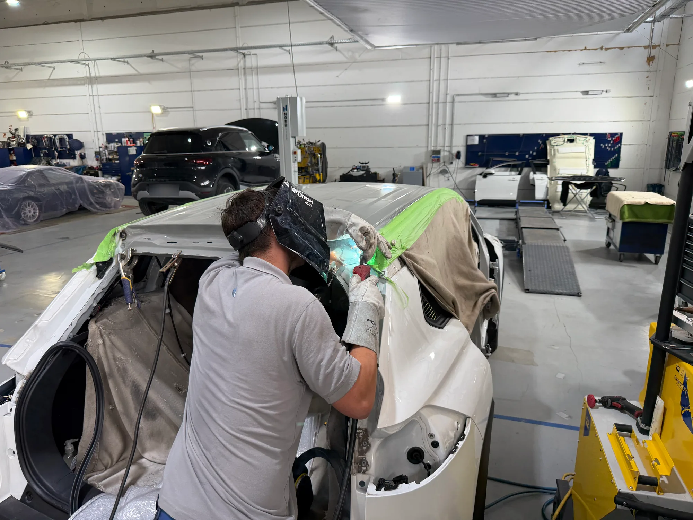 | `kacheln/unfallinstandsetzung-leipzig-carcare.webp` 2000 × 1500 · 238 KB | Karosseriebauer mit Schweißhelm schweißt an der Dachsäule eines weißen, abgeklebten Unfallfahrzeugs; Werkhalle im Hintergrund | **5×** B10 ✅, B37 ✅, B77 ✅, B85 ✅, B95 ✅ | nicht committet, Datei geändert am 21.09.2026 | echtes Foto aus dem Betrieb (Lieferung „Neue Fotos Schleife September“, eingebaut 21.09.2026; Original „Unfallinstandsetzung-leipzig-carcare.webp.jpeg“, aufgenommen 04.09.2026); laut User weder KI-generiert noch -bearbeitet; Kennzeichen eines SUV im Hintergrund weichgezeichnet |  |
| 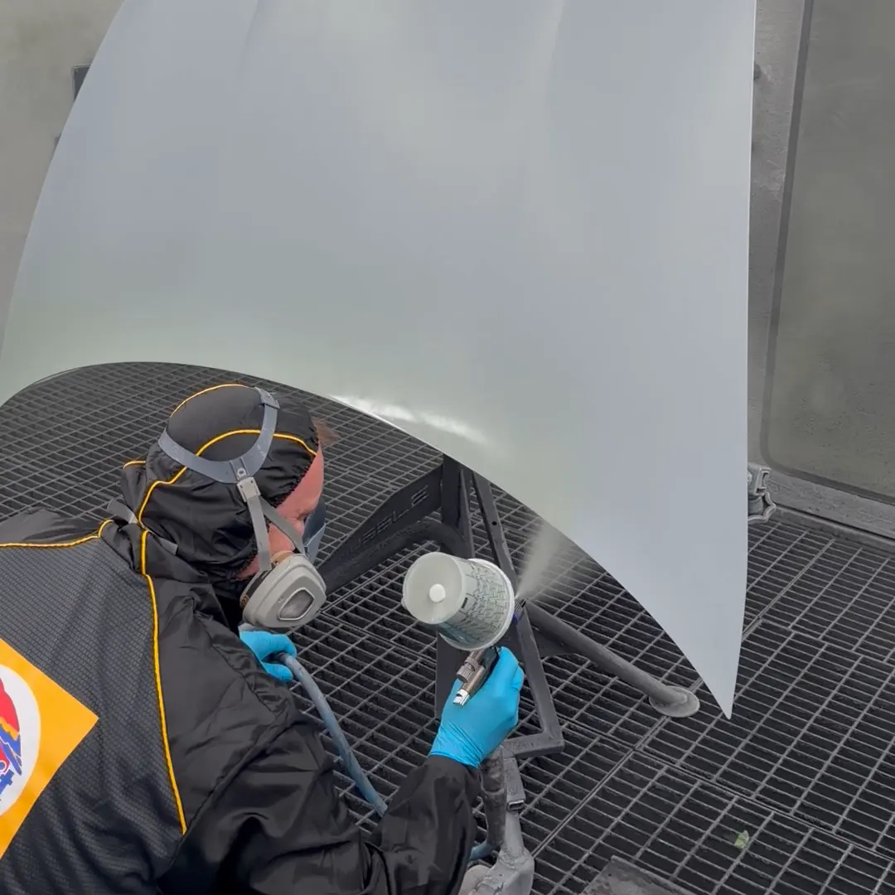 | `carcare-autolackierung-standbild.webp` 1080 × 1080 · 65 KB | Standbild des Lackiervideos bei 4,0 s: Lackierer mit Atemschutz und Pistole, Sprühnebel | **1×** B11 ✅ | nicht committet, Datei geändert am 21.09.2026 | Standbild aus dem Lackiervideo (Lieferung „Neue Fotos Schleife September“, eingebaut 21.09.2026) |  |
|  | `kacheln/smart-repair-leipzig-carcare.webp` 1400 × 1045 · 100 KB | Mitarbeiter bearbeitet die Tür eines schwarzen Porsche Macan | **7×** B12, B39, B61, B68, B78, B87, B97 | 16.07.2026 | nicht dokumentiert (16.07.2026) | 3.10 zeigt Aufbereitung, nicht Smart Repair (Motiv über 3.25) · R2 steht auch leihweise für „Leasingrückgabe vorbereiten“ · Kennzeichen am rechten Bildrand teilweise lesbar |
|  | `kacheln/dellenentfernung-leipzig-carcare.webp` 2000 × 1500 · 207 KB | Dellentechniker mit Reflexionslampe und Ausbeulwerkzeug an der A-Säule eines dunkelgrauen Porsche (4:3 aus Hochformat) | **6×** B13 ✅, B40 ✅, B60 ✅, B70 ✅, B79 ✅, B88 ✅ | nicht committet, Datei geändert am 21.09.2026 | echtes Foto aus dem Betrieb (Lieferung „Neue Fotos Schleife September“, eingebaut 21.09.2026; Original „dellenentfernung-leipzig-carcare.webp.jpeg“, aufgenommen 19.08.2026); laut User weder KI-generiert noch -bearbeitet |  |
|  | `kacheln/hagelschadenreparatur-leipzig.webp` 1400 × 1045 · 104 KB | Mitarbeiter drückt am Dach eines grauen Porsche Panamera Dellen aus, Leuchtschirm darüber | **6×** B14, B41, B71, B81, B89, B98 | 16.07.2026 | nicht dokumentiert (16.07.2026) | 3.27 Foto Hagelschaden (Archiv oder anstehendes Fahrzeug) |
|  | `kacheln/felgenreparatur-leipzig-carcare.webp` 1400 × 1045 · 96 KB | Beschädigte Felge mit Bordsteinschaden in Nahaufnahme | **7×** B15, B42, B62, B72, B82, B90, B99 | 16.07.2026 | nicht dokumentiert (16.07.2026) | 3.28 Felge in Reparatur / beim Lackieren (vorhanden sind nur beschädigte Felgen) |
|  | `kacheln/autoglas-scheibenreparatur-leipzig-carcare.webp` 1200 × 896 · 113 KB | Zwei Mitarbeiter setzen an einem roten Mercedes SLS (Flügeltüren) die Frontscheibe ein | **6×** B16, B43, B63, B74, B83, B91 | 16.07.2026 | nicht dokumentiert (16.07.2026) |  |
|  | `kacheln/leasingrueckgabe-leipzig-carcare.webp` 1400 × 1045 · 155 KB | Grauer Audi Q8 e-tron mit allen Türen und Heckklappe offen in der Halle | **3×** B17, B35, B59 | 16.07.2026 | nicht dokumentiert (16.07.2026) |  |
|  | `kacheln/autohaus-fuhrpark-service-leipzig-carcare.webp` 1400 × 1045 · 123 KB | Mann mit Tablet vor einer Reihe Porsche (Cayenne, Panamera) in großer Halle | **3×** B18, B73, B106 🟠 | 16.07.2026 | nicht dokumentiert (16.07.2026) |  |
|  | `kacheln/schaden-melden-leipzig-carcare.webp` 2400 × 1340 · 126 KB | Frau meldet per Smartphone einen Schaden, dahinter gelber Ferrari mit Seitenschaden | **1×** B19 | 22.07.2026 | laut Commit 0d25f7b „echtes Kundenfoto“ (22.07.2026) |  |
|  | `kacheln/versicherung-schadenabwicklung-leipzig-carcare.webp` 1200 × 896 · 112 KB | Mitarbeiter mit Tablet kniet hinter einem silbernen Porsche Taycan mit Heckschaden | **1×** B20 ✅ | 16.07.2026 | nicht dokumentiert (16.07.2026) | Seit 21.09.2026 an B20 (Schadenaufnahme) auf Wunsch des Users; B10 und seine übrigen Stellen zeigen das neue Unfallfoto |
|  | `kacheln/kalkulation-leipzig-carcare.webp` 2400 × 1357 · 141 KB | Kundin unterschreibt am Tresen, Berater mit Tablet, gelber Ferrari im Hintergrund | **2×** B21, B109 🟠 | 22.07.2026 | nicht dokumentiert (22.07.2026) |  |
|  | `kacheln/versicherungsabwicklung-leipzig-carcare.webp` 2400 × 1357 · 120 KB | Mitarbeiterin telefoniert am Schreibtisch mit Tablet, gelber Ferrari im Hintergrund | **1×** B22 | 22.07.2026 | nicht dokumentiert (22.07.2026) |  |
|  | `kacheln/ersatzwagen-leipzig-carcare.webp` 2000 × 1500 · 375 KB | Unsere Mietwagenflotte: Reihe weißer VW Polo mit Beschriftung des CarCare Center vor der Halle (4:3 aus Hochformat) | **1×** B23 ✅ | nicht committet, Datei geändert am 21.09.2026 | echtes Foto aus dem Betrieb (Lieferung „Neue Fotos Schleife September“, eingebaut 21.09.2026; Original „ersatzwagen-leipzig-carcare.webp.jpeg“, aufgenommen 11.06.2026); laut User weder KI-generiert noch -bearbeitet |  |
|  | `kacheln/privatkunden-leipzig-carcare.webp` 2400 × 1018 · 192 KB | Empfangstresen mit CarCare-Center-Logo, Mitarbeiterin berät einen Kunden | **3×** B24, B32, B75 | 22.07.2026 | laut Commit acfcd0c „echte Fotos“ (22.07.2026) |  |
|  | `kacheln/versicherungen-und-agenturen-leipzig-carcare.webp` 2400 × 1357 · 361 KB | Große Werkhalle mit vielen Fahrzeugen, zwei Mitarbeitende mit Tablet in der Mitte | **1×** B25 | 22.07.2026 | laut Commit acfcd0c „echte Fotos“ (22.07.2026) |  |
|  | `kacheln/autohaeuser-und-fuhrparks-leipzig-carcare.webp` 2000 × 1500 · 382 KB | Grüner Porsche Cayenne auf unserem Autotransporter vor der Werkstatthalle | **2×** B26 ✅, B84 ✅ | nicht committet, Datei geändert am 21.09.2026 | echtes Foto aus dem Betrieb (Lieferung „Neue Fotos Schleife September“, eingebaut 21.09.2026; Original „autohaueser-und- fuhrparks-leipzig-carcare.webp.jpeg“, aufgenommen 27.07.2026); laut User weder KI-generiert noch -bearbeitet; Kennzeichen eines Cabrios im Hintergrund weichgezeichnet |  |
|  | `kacheln/innenaufbereitung-leipzig-carcare.webp` 2000 × 1500 · 416 KB | Mitarbeiter reinigt mit Pinsel die Mittelkonsole eines Porsche Taycan (Pepita-Sitze) | **3×** B27 ✅, B45 ✅, B67 ✅ | nicht committet, Datei geändert am 21.09.2026 | echtes Foto aus dem Betrieb (Lieferung „Neue Fotos Schleife September“, eingebaut 21.09.2026; Original „innenaufbereitung-leipzig-carcare.webp.jpeg“, aufgenommen 19.08.2026); laut User weder KI-generiert noch -bearbeitet |  |
| 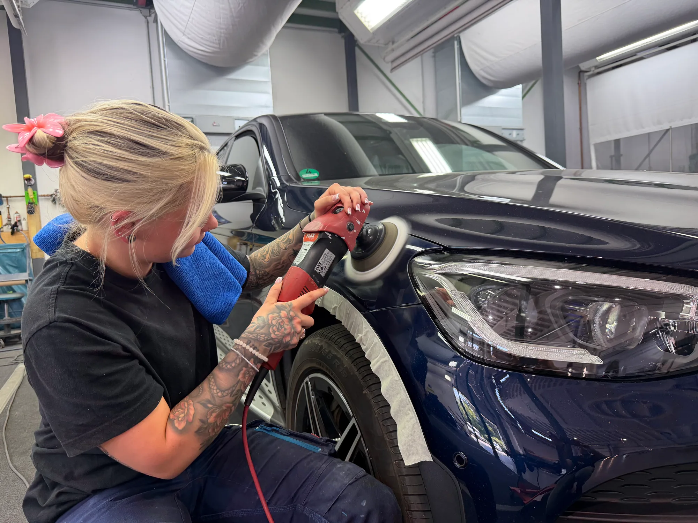 | `kacheln/lackaufbereitung-leipzig-carcare.webp` 2000 × 1500 · 301 KB | Mitarbeiterin poliert mit der Poliermaschine den Kotflügel eines dunkelblauen SUV, Radlauf abgeklebt | **4×** B28 ✅, B46 ✅, B47 🟠, B66 ✅ | nicht committet, Datei geändert am 21.09.2026 | echtes Foto aus dem Betrieb (Lieferung „Neue Fotos Schleife September“, eingebaut 21.09.2026; Original „Lackaufbereitung-leipzig-carcare.webp.jpeg“, aufgenommen 16.07.2026); laut User weder KI-generiert noch -bearbeitet | Steht an B28, B46, B47, B66 – B47 wird später ersetzt (Kunde, 22.09.2026), bis dahin stehen B46 und B47 nebeneinander mit demselben Foto |
| 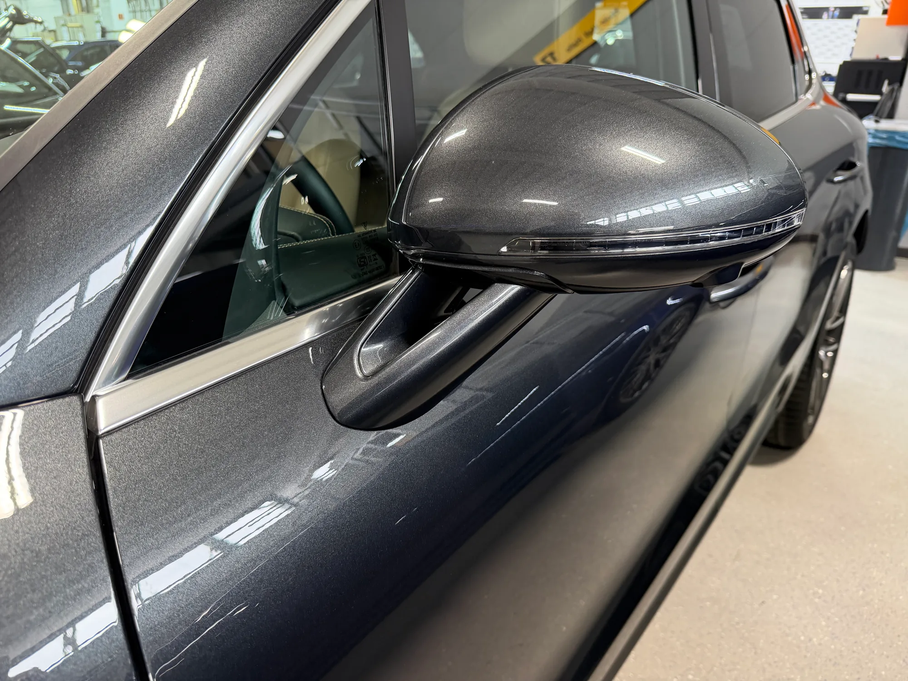 | `kacheln/leasingrueckgabe-aufbereitung-leipzig-carcare.webp` 2000 × 1500 · 407 KB | Außenspiegel und Fahrertür eines dunkelgrauen Porsche in Nahaufnahme, frisch aufbereitet | **1×** B29 ✅ | nicht committet, Datei geändert am 21.09.2026 | echtes Foto aus dem Betrieb (Lieferung „Neue Fotos Schleife September“, eingebaut 21.09.2026; Original „leasingrueckgabe-aufbereitung-leipzig-carcare.webp.jpeg“, aufgenommen 18.08.2026); laut User weder KI-generiert noch -bearbeitet |  |
|  | `kacheln/wissensdatenbank-leipzig-carcare.webp` 2400 × 1340 · 85 KB | Roter Kotflügel eines Mercedes SLS in Nahaufnahme | **1×** B30 | 23.07.2026 | Kundenmotiv (Commit de2069b, 23.07.2026) |  |
| 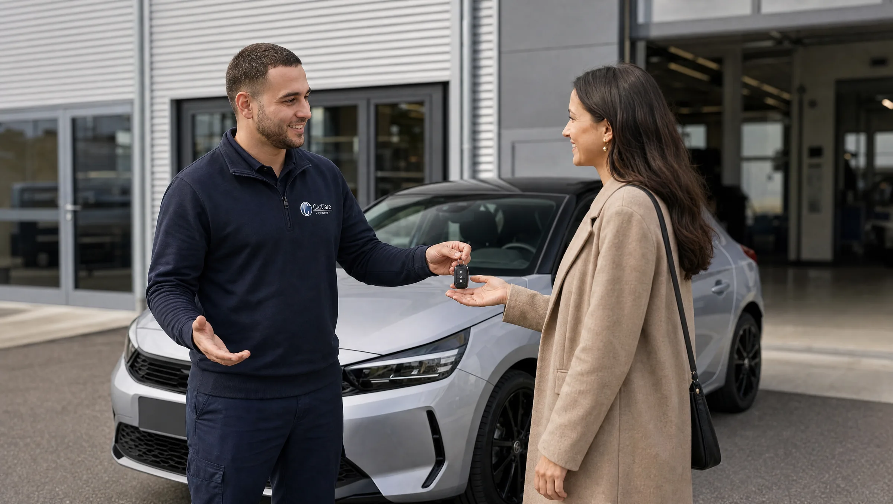 | `kacheln/fahrzeugabgabe-leipzig-carcare.webp` 2400 × 1357 · 160 KB | Mitarbeiter übergibt einer Kundin den Schlüssel, silberner Kleinwagen vor der Halle | **1×** B33 🟢 | 22.07.2026 | nicht dokumentiert (22.07.2026); bis 21.09.2026 als ersatzwagen-leipzig-carcare.webp, Motiv unverändert |  |
| 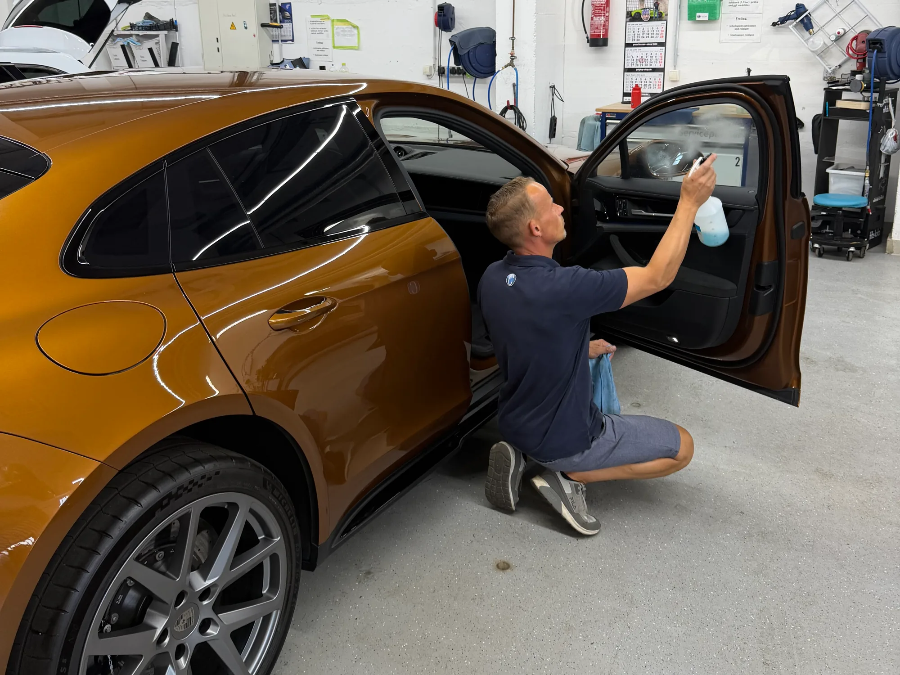 | `kacheln/aufbereitung-aktiv-leipzig-carcare.webp` 2000 × 1500 · 270 KB | Mitarbeiter reinigt kniend die Scheibe der geöffneten Fahrertür eines kupferfarbenen Porsche Macan (4:3 aus Hochformat) | **1×** B34 ✅ | nicht committet, Datei geändert am 21.09.2026 | echtes Foto aus dem Betrieb (Lieferung „Neue Fotos Schleife September“, eingebaut 21.09.2026; Original „Aufbereitung-aktiv-leipzig-carcare.webp.jpeg“, aufgenommen 25.07.2026); laut User weder KI-generiert noch -bearbeitet |  |
| 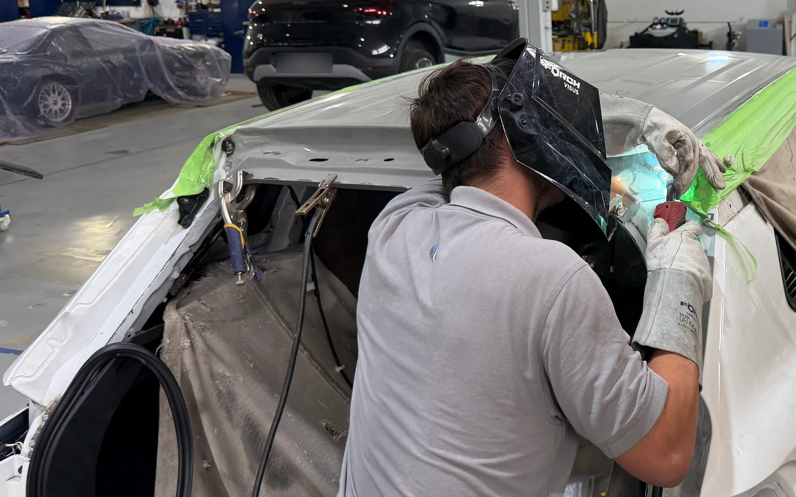 | `kacheln/unfallinstandsetzung-hintergrund-leipzig-carcare.webp` 2000 × 1250 · 237 KB | Ausschnitt des Unfallfotos für den Seitenhintergrund: Schweißer mit Helm an der Dachsäule, rechts der Mitte (16:10) | **1×** B36 ✅ | nicht committet, Datei geändert am 21.09.2026 | echtes Foto aus dem Betrieb (Lieferung „Neue Fotos Schleife September“, eingebaut 21.09.2026; Original „Unfallinstandsetzung-leipzig-carcare.webp.jpeg“, aufgenommen 04.09.2026); laut User weder KI-generiert noch -bearbeitet; Kennzeichen eines SUV im Hintergrund weichgezeichnet |  |
|  | `kacheln/autolackierung-leipzig-carcare.webp` 2000 × 1500 · 125 KB | Lackierer mit Lackierpistole an einem abgeklebten Stoßfänger, Fahrzeug mit Folie und Papier abgedeckt (4:3 aus Hochformat) | **5×** B38 ✅, B64 ✅, B80 ✅, B86 ✅, B96 ✅ | nicht committet, Datei geändert am 21.09.2026 | echtes Foto aus dem Betrieb (Lieferung „Neue Fotos Schleife September“, eingebaut 21.09.2026; Original „autolackierung-leipzig-carcare.webp.jpeg“, aufgenommen 19.08.2026); laut User weder KI-generiert noch -bearbeitet |  |
| 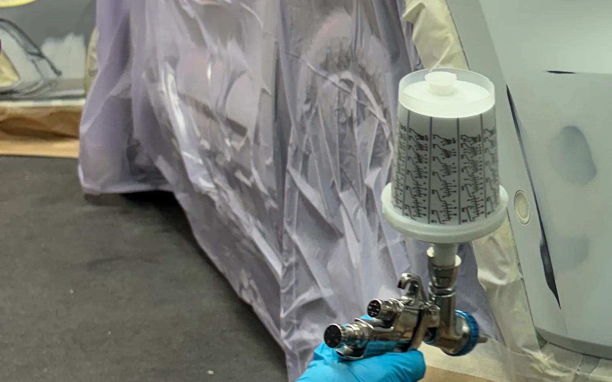 | `kacheln/autolackierung-hintergrund-leipzig-carcare.webp` 1512 × 945 · 61 KB | Ausschnitt des Lackierfotos für den Seitenhintergrund: Lackierpistole und Handschuh vor der abgeklebten Stoßfängerkante (16:10) | **1×** B69 ✅ | nicht committet, Datei geändert am 21.09.2026 | echtes Foto aus dem Betrieb (Lieferung „Neue Fotos Schleife September“, eingebaut 21.09.2026; Original „autolackierung-leipzig-carcare.webp.jpeg“, aufgenommen 19.08.2026); laut User weder KI-generiert noch -bearbeitet |  |
|  | `carcare-ueber-uns-hero-standbild.webp` 1920 × 1080 · 138 KB | Weite Werkhalle mit vielen Fahrzeugen (Standbild bei 31,1 s) | **1×** B93 | 07.09.2026 | Standbild aus dem Betriebsvideo des Kunden (Lieferung 07.09.2026) |  |
|  | `carcare-ueber-uns-hero.mp4` 2173 KB | Video: Schwenk durch die Werkstatt (Ausschnitt 9,0–21,2 s) | **1×** B94 | 07.09.2026 | Betriebsvideo des Kunden (Lieferung 07.09.2026) |  |
|  | `carcare-betriebsrundgang-standbild.webp` 1920 × 1080 · 113 KB | Werkhalle von oben: weißer VW Golf, mintfarbener Porsche Taycan, Audi mit offener Haube | **1×** B101 | nicht committet, Datei geändert am 21.09.2026 | Standbild aus dem Betriebsvideo des Kunden (Lieferung 07.09.2026); aus der entschärften Fassung (21.09.2026) |  |
|  | `carcare-betriebsrundgang.mp4` 3457 KB | Video: Rundgang vom Waschplatz bis zur Lackierkabine (Ausschnitt 21,5–52,2 s) | **1×** B102 | nicht committet, Datei geändert am 21.09.2026 | Betriebsvideo des Kunden (Lieferung 07.09.2026); seit 21.09.2026 ein Kennzeichen weichgezeichnet (R16), Einwilligung der Mitarbeitenden liegt laut User vor | 4.14 vollständiges Drohnenvideo, Schwenk durch die Karosserieabteilung fehlt |
| 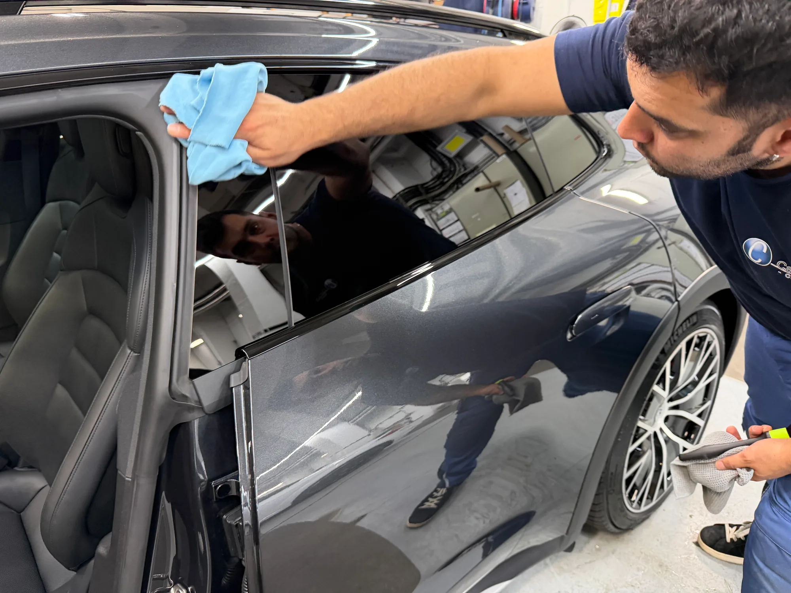 | `kacheln/karriere-aufbereiter-leipzig-carcare.webp` 2000 × 1500 · 204 KB | Kfz-Aufbereiter im Firmenshirt wischt den Türrahmen eines dunkelgrauen Porsche Taycan | **1×** B103 ✅ | nicht committet, Datei geändert am 21.09.2026 | echtes Foto aus dem Betrieb (Lieferung „Neue Fotos Schleife September“, eingebaut 21.09.2026; Original „karriere-aufbereiter-leipzig-carcare.webp.jpeg“, aufgenommen 20.08.2026); laut User weder KI-generiert noch -bearbeitet; zeigt einen Mitarbeiter, Einwilligung liegt laut User vollständig vor |  |
| 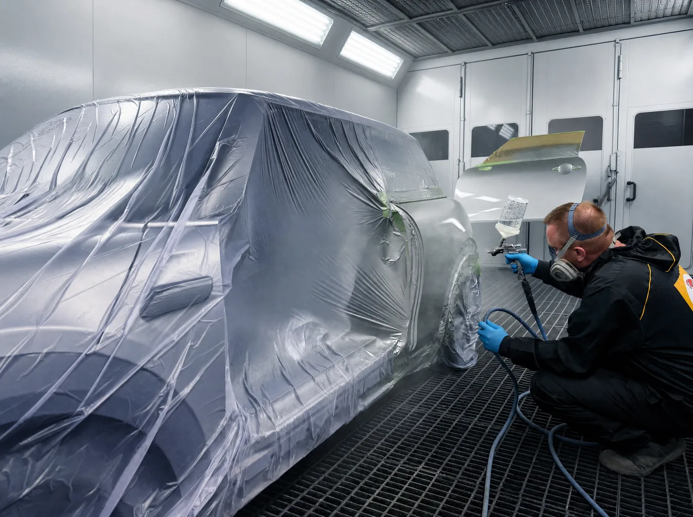 | `kacheln/lackierkabine-leipzig-carcare.webp` 1400 × 1045 · 160 KB | Lackierer mit Atemschutz lackiert in der Kabine ein mit Folie abgedecktes Fahrzeug | **2×** B104 🟢, B107 🟠 | 16.07.2026 | nicht dokumentiert (16.07.2026); bis 21.09.2026 als autolackierung-leipzig-carcare.webp, Motiv unverändert | Steht nur noch an B104 (bleibt, Kunde) und B107 („erstmal stehen lassen“) |
| 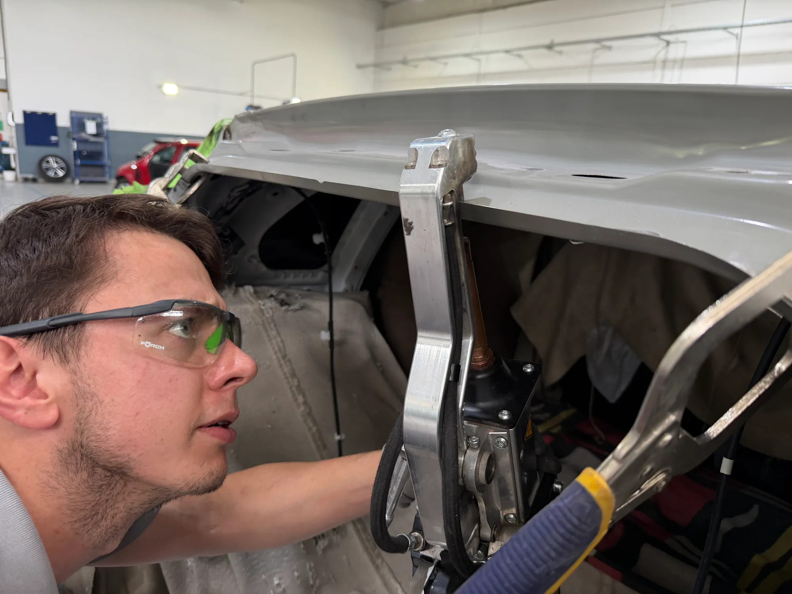 | `kacheln/karriere-fahrzeugbau-leipzig-carcare.webp` 2000 × 1500 · 146 KB | Karosseriebauer mit Schutzbrille an der Punktschweißzange am Dachrahmen eines Unfallfahrzeugs | **2×** B105 ✅, B108 ✅ | nicht committet, Datei geändert am 21.09.2026 | echtes Foto aus dem Betrieb (Lieferung „Neue Fotos Schleife September“, eingebaut 21.09.2026; Original „karriere-fahrzeugbau-leipzig-carcare.webp.jpeg“, aufgenommen 04.09.2026); laut User weder KI-generiert noch -bearbeitet; zeigt einen Mitarbeiter, Einwilligung liegt laut User vollständig vor |  |
|  | `carcare-arbeitsplatz-standbild.webp` 1920 × 1080 · 120 KB | Zwei Mitarbeiter an einem grauen Mercedes mit offener Tür (Standbild bei 71,1 s) | **1×** B110 | nicht committet, Datei geändert am 21.09.2026 | Standbild aus dem Betriebsvideo des Kunden (Lieferung 07.09.2026); aus der entschärften Fassung (Kennzeichen weichgezeichnet, 21.09.2026) |  |
|  | `carcare-arbeitsplatz.mp4` 3414 KB | Video: von der Lackierkabine bis zum Reifenraum (Ausschnitt 46,3–75,9 s) | **1×** B111 | nicht committet, Datei geändert am 21.09.2026 | Betriebsvideo des Kunden (Lieferung 07.09.2026); seit 21.09.2026 vier Kennzeichen weichgezeichnet (R16, npm run video), Einwilligung der Mitarbeitenden liegt laut User vor |  |
|  | `carcare-autolackierung.mp4` 917 KB | Video: Lackierer lackiert in der Kabine eine Motorhaube (Ausschnitt 2,0–15,0 s, quadratisch, 720 × 720) | **1×** B112 ✅ | nicht committet, Datei geändert am 21.09.2026 | Video aus dem Betrieb (Lieferung „Neue Fotos Schleife September“, eingebaut 21.09.2026; Original „Video - Lackieren.mov“, aufgenommen 19.08.2026); laut User echt |  |

## Platzhalter: hier fehlt ein Foto oder Video

- **Fahrzeugaufbereitung**, B48, B49, B50, B51, B52, B53, B54, B55, B56, B57, B58: 3.23 Fotopaket Aufbereitung (während der Arbeit) füllt diese Galerie, erledigt damit auch 2.2 und 3.6
- **Über uns**, B113, B114, B115: R18 Bereichsvideos Karosserie- und Mechanik-, Lackier- und Aufbereitungsbereich (Wunsch des Users 21.09.2026); dieselben drei Filme stehen auch auf /karriere. Material liefert André
- **Karriere**, B116, B117, B118: R18 Bereichsvideos wie auf /ueber-uns (ein Eintrag je Bereich in data/videos.ts, beide Seiten zugleich)

## Grafiken und Logos (keine Fotos)

| Datei | Wo | Datum der Anpassung |
|---|---|---|
| `carcare-center-apple-touch-icon.png` 180 × 180 · 8 KB | Favicon (Browser-Tab) (alle Seiten) | 20.09.2026 |
| `carcare-center-favicon-192.png` 192 × 192 · 16 KB | Favicon (Browser-Tab) (alle Seiten) | 20.09.2026 |
| `carcare-center-favicon-48.png` 48 × 48 · 3 KB | Favicon (Browser-Tab) (alle Seiten) | 20.09.2026 |
| `carcare-center-logo.webp` 842 × 596 · 73 KB | Logo-Plakette in Karten (Startseite, Karriere) | 03.06.2026 |
| `carcare-center-mark-animated.mp4` 1623 KB | Kopfzeile (alle Seiten); Logo-Plakette in Karten (Startseite); Fußzeile (alle Seiten) | 17.06.2026 |
| `carcare-center-mark.webp` 264 × 264 · 9 KB | Ladebildschirm beim ersten Aufruf der Startseite | 24.07.2026 |
| `carcare-center-wordmark-dark.webp` 840 × 273 · 26 KB | Ladebildschirm beim ersten Aufruf der Startseite | 24.07.2026 |
| `carcare-center-wordmark-weiss.png` 2118 × 687 · 31 KB | Fußzeile (alle Seiten) | 23.07.2026 |
| `carcare-center-wordmark.png` 3711 × 1205 · 84 KB | Kopfzeile (alle Seiten) | 17.06.2026 |
| `eu-emblem.svg` 3 KB | Fußzeile (alle Seiten) | 24.07.2026 |
| `partner/bvat.webp` 800 × 212 · 27 KB | „Von der Kalkulation bis zur …“ (Hagelschadenreparatur); „Woran sich die Arbeitsqualität festmachen lässt“ (Über uns) | 17.09.2026 |
| `partner/riparo.webp` 208 × 50 · 1 KB | „Der richtige Ansprechpartner für Ihr Fahrzeug“ › Karte „Versicherungen & Agenturen“ (Startseite); „Für diese Unternehmen arbeiten wir bereits“ › Karte „Versicherer & Schadensteuerer“ (Geschäftskunden) | 17.09.2026 |

## Gegenprobe

- **Routen besucht:** 29 von 29 (Quelle `scripts/routes.mjs`), jede mit gerenderter h1.
- **Dateien unter `public/assets/`** (ohne Schriften): 54. Davon im Rundgang gesehen: 52, nur im Code: 1, unbenutzt: 1.
- **Im Code, beim Rundgang nicht gesehen:** nichts Neues.
- **Bekannt und begründet** (`motive.json` → `bekannt`), deshalb nicht angezeigt:
  - `carcare-hero-workshop.webp` in `components/ExpandingCardAccordion.tsx`, `components/TargetGroupCards.tsx`, `pages/UeberUnsPage.tsx`: Ersatzbild: DEFAULT_CARD_BG in ExpandingCardAccordion und TargetGroupCards, Rückfall in UeberUnsPage. Greift nur, wenn einer Karte das Motiv fehlt, und ist deshalb derzeit nirgends sichtbar.
  - `Unsplash-Stockfoto` in `components/Hero.tsx`: Steht nur im toten components/Hero.tsx, das laut Vorgabe ohne Import unangetastet bleibt (offene-punkte-konsolidiert.md, Paket G).
- **Unbenutzt** (weder angezeigt noch im Code, wird trotzdem mit ausgeliefert): `kacheln/schadenaufnahme-leipzig-carcare.webp`
- **Entfallene Nummern:** keine

## Was diese Liste nicht sieht

- Bilder, die erst nach einem Klick erscheinen (Dialoge), und Motive nur für Tablet-Breiten. Beide fängt die Gegenprobe oben ab, sofern der Pfad im Code steht.
- Sektionshintergründe, die das Bild der aktiven Karte spiegeln: keine eigene Stelle, Hinweis steht unter der jeweiligen Seite.
- Ob ein Foto KI-generiert oder -bearbeitet ist. Das lässt sich einem Bild nicht ansehen und wird nicht geraten.
